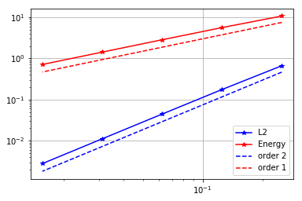
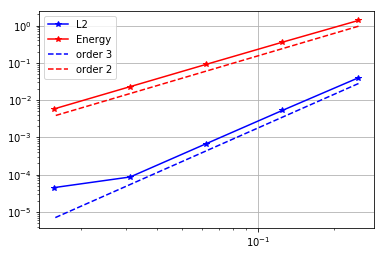

# Convergence rates (2D Poisson equation)

In this notebook we numerically verify the theoretical converge rates of the finite element discretization of an elliptic problem.

Specifically, for a domain $$\Omega \subset \mathbb{R}^2$$ with boundary $$\partial \Omega = \Gamma_D \cup \Gamma_N$$, we consider the  the boundary value problem (BVP):

$$ 
\left\{
\begin{array}{ll}
- \Delta u = f  & \text{in} \; \Omega, \\
u = u_D & \text{on} \; \Gamma_D, \\
\nabla u \cdot \boldsymbol{n} = g & \text{on} \; \Gamma_N.
\end{array}
\right.$$

Here, $$\Gamma_D \subset \Omega$$ denotes the part of the boundary where we prescribe Dirichlet boundary conditions, and $$\Gamma_N \subset \Omega$$ denotes the part of the boundary where we prescribe Neumann boundary conditions. $$\boldsymbol{n}$$ denotes the unit normal of $$\partial \Omega$$ pointing outside $$\Omega$$. 

The coefficient $$f$$, $$g$$, $$u_D$$ are chosen such that the analytical solution is $$u_{ex} = e^{\pi y} \sin(\pi x)$$.

To obtain the weak form, we define the functional spaces $$V_{u_D} = \{ v \in H^1(\Omega) \, \vert\, v = u_D \,{\rm on }\, \Gamma_D\}$$ and $$V_{0} = \{ v \in H^1(\Omega) \, \vert \, v = 0 \,{\rm on }\, \Gamma_D\}$$.

Then, the weak formulation of the boundary value problem reads

Find $$u \in V_{u_D}$$:
$$ \int_\Omega \nabla u \cdot \nabla v \, dx = \int_\Omega f\,v \, dx + \int_{\Gamma_N} g\,v\,ds, \quad \forall v \in V_0. $$

Finally, to obtain the finite element discretization we introduce a uniform triangulation (mesh) $$\mathcal{T}_h$$ of the domain $$\Omega$$ and finite dimensional subspace $$V_h \subset H^1(\Omega)$$. 
The space $$V_{h}$$ consists of globally continuous functions that are piecewise polynomial with degree $$k$$ on each element $$\tau$$ of the mesh $$\mathcal{T}_h$$, that is
$$ V_h := \left\{ v_h \in V \; \vert \; \left. v_h \right\vert_{\tau} \in P^{k} \quad  \forall \tau \in \mathcal{T}_h \right\},$$
where $$P^{k}$$ denotes the space of polynomial function with degree $$k$$.

By letting $$V_{h, u_D} := \{ v_h \in V_h \, \vert \, v_h = u_D \text{ on } \Gamma_D\}$$ and $$V_{h, 0} := \{ v_h \in V_h \, \vert \, v_h = 0 \text{ on } \Gamma_D\}$$, the finite element discretization of the BVP reads:

Find $$u_h \in V_{h, u_D}$$ such that
$$ \int_\Omega \nabla u_h \cdot \nabla v_h \, dx = \int_\Omega f\,v_h \, dx + \int_{\Gamma_N} g\,v_h\,ds, \quad \forall v_h \in V_{h,0}. $$

## Finite element error estimates

Assuming that the analytical solution is regular enough (i.e. $$u_{\rm ex} \in H^{k+1}(\Omega)$$), the following error estimates hold

- Energy norm:
$$ \left\| u_{\rm ex} - u_h \right\|_{\rm energy} := \left( \int_\Omega \left\vert \nabla u_{\rm ex} - \nabla u_{h}\right\vert^2 dx \right)^{\frac{1}{2}} = \mathcal{O}(h^k), $$

- $$L^2(\Omega)$$ norm:
$$ \left\| u_{\rm ex} - u_h \right\|_{L^2} := \left( \int_\Omega \left\vert u_{\rm ex} - u_{h}\right\vert^2 dx \right)^{\frac{1}{2}} = \mathcal{O}(h^{k+1}), $$

where $$h$$ denote the mesh size.

## Step 1. Import modules


```python
from __future__ import print_function, division, absolute_import

import dolfin as dl
import numpy as np

import matplotlib.pyplot as plt
%matplotlib inline

import logging
logging.getLogger('FFC').setLevel(logging.WARNING)
logging.getLogger('UFL').setLevel(logging.WARNING)
dl.set_log_active(False)
```

## Step 2. Finite element solution of the BVP

Here we implement a function `solveBVP` that computes the finite element discretizions and solves the discretized problem.

As input, it takes the number of mesh elements `n` in each direction and the polynomial degree `degree` of the finite element space. As output, it returns the errors in the $$L^2$$ and energy norm.


```python
def solveBVP(n, degree):
    # 1. Mesh and finite element space
    mesh = dl.UnitSquareMesh(n,n)
    Vh = dl.FunctionSpace(mesh, 'CG', degree)

    # 2. Define the right hand side f and g
    f = dl.Constant(0.)
    g = dl.Expression("DOLFIN_PI*exp(DOLFIN_PI*x[1])*sin(DOLFIN_PI*x[0])", degree=degree+2)
    
    # 3. Define the Dirichlet boundary condition
    u_bc = dl.Expression("sin(DOLFIN_PI*x[0])", degree = degree+2)
    def dirichlet_boundary(x,on_boundary):
        return (x[1] < dl.DOLFIN_EPS or x[0] < dl.DOLFIN_EPS or x[0] > 1.0 - dl.DOLFIN_EPS) and on_boundary
    bcs = [dl.DirichletBC(Vh, u_bc, dirichlet_boundary)]

    # 4. Define the weak form
    uh = dl.TrialFunction(Vh)
    vh = dl.TestFunction(Vh)
    A_form = dl.inner(dl.grad(uh), dl.grad(vh))*dl.dx
    b_form = f*vh*dl.dx + g*vh*dl.ds

    # 5. Assemble and solve the finite element discrete problem
    A, b = dl.assemble_system(A_form, b_form, bcs)
    uh = dl.Function(Vh)
    dl.solve(A, uh.vector(), b, "cg", "petsc_amg")

    # 6. Compute error norms
    u_ex = dl.Expression("exp(DOLFIN_PI*x[1])*sin(DOLFIN_PI*x[0])", degree = degree+2, domain=mesh)
    err_L2 = np.sqrt( dl.assemble((uh-u_ex)**2*dl.dx) ) 

    grad_u_ex = dl.Expression( ("DOLFIN_PI*exp(DOLFIN_PI*x[1])*cos(DOLFIN_PI*x[0])",
                         "DOLFIN_PI*exp(DOLFIN_PI*x[1])*sin(DOLFIN_PI*x[0])"), degree = degree+2, domain=mesh )
    err_energy = np.sqrt(dl.assemble(dl.inner(dl.grad(uh) - grad_u_ex, dl.grad(uh) - grad_u_ex)*dl.dx))
    
    return err_L2, err_energy
```

## Step 3. Generate the converges plots

The function `make_convergence_plot` generates the converges plots.

It takes as input a `numpy.array n` that contains a sequence of number of mesh elements and the polynomial degree `degree` of the finite element space.

It plots the energy norm of the error (in red) and the $$L^2$$ norm of the error (in blue) in a loglog scale. The $$x$$-axis is the mesh size $$h$$.

The slope of the lines in the loglog scale represents the order of converge and dotted lines represents the expected convergence rate.


```python
def make_convergence_plot(n, degree):
    errs_L2 = np.zeros(n.shape)
    errs_En = np.zeros(n.shape)
    
    for i in np.arange(n.shape[0]):
        print(i, ": Solving problem on a mesh with", n[i], " elements.")
        eL2, eE = solveBVP(n[i], degree)
        errs_L2[i] = eL2
        errs_En[i] = eE
        
    h = np.ones(n.shape)/n
    plt.loglog(h, errs_L2, '-*b', label='L2')
    plt.loglog(h, errs_En, '-*r', label='Energy')
    plt.loglog(h, .7*np.power(h,degree+1)*errs_L2[0]/np.power(h[0],degree+1), '--b', label = 'order {0}'.format(degree+1))
    plt.loglog(h, .7*np.power(h,degree)*errs_En[0]/np.power(h[0],degree), '--r', label = 'order {0}'.format(degree))
    plt.legend()
    plt.grid()
    plt.show()
    
```

## Converges rate of piecewise linear finite element (k=1)


```python
degree = 1
n = np.power(2, np.arange(2,7)) # n = [2^2, 2^3, 2^4 2^5, 2^6]
make_convergence_plot(n, degree)
```

    0 : Solving problem on a mesh with 4  elements.
    1 : Solving problem on a mesh with 8  elements.
    2 : Solving problem on a mesh with 16  elements.
    3 : Solving problem on a mesh with 32  elements.
    4 : Solving problem on a mesh with 64  elements.





## Converges rate of piecewise quadratic finite element (k=2)


```python
degree = 2
make_convergence_plot(n, degree)
```

    0 : Solving problem on a mesh with 4  elements.
    1 : Solving problem on a mesh with 8  elements.
    2 : Solving problem on a mesh with 16  elements.
    3 : Solving problem on a mesh with 32  elements.
    4 : Solving problem on a mesh with 64  elements.





> Copyright &copy; 2018, The University of Texas at Austin & University of California, Merced. All Rights reserved. See file COPYRIGHT for details.

> This file is part of the hIPPYlib library. For more information and source code availability see https://hippylib.github.io.

> hIPPYlib is free software; you can redistribute it and/or modify it under the terms of the GNU General Public License (as published by the Free Software Foundation) version 2.0 dated June 1991.
