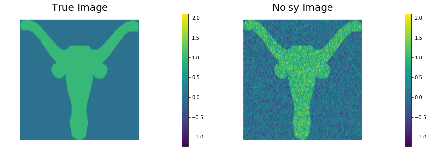
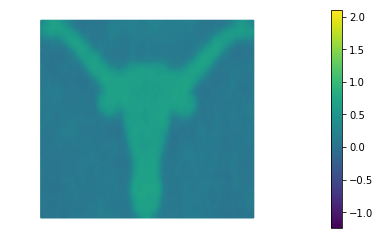
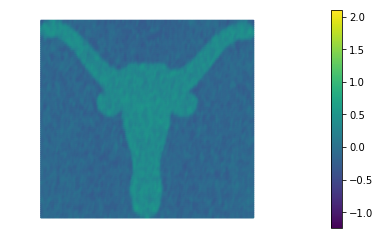
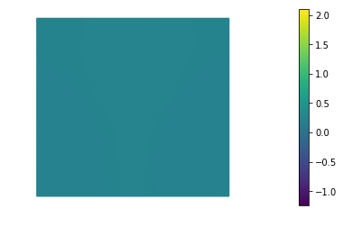
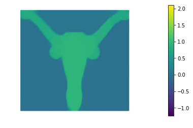

# Image Denoising: Tikhonov and Total Variation Regularization

The problem of removing noise from an image without blurring
sharp edges can be formulated as an infinite-dimensional minimization
problem. Given a possibly noisy image $u_0(x,y)$ defined within a
rectangular domain $\Omega$, we would like to
find the image $u(x,y)$ that is closest in the $L_2$ sense, i.e. we
want to minimize 

$$ \mathcal{F}_{LS} := \frac{1}{2}\int_\Omega (u - u_0)^2 \; d\boldsymbol{x}, $$


while also removing noise, which is assumed to comprise very *rough*
components of the image. This latter goal can be incorporated as an
additional term in the objective, in the form of a penalty, i.e., 

$$ \mathcal{R}_{TN} := \! \frac{\alpha}{2}\int_\Omega \nabla u
\cdot \! \nabla u \; d\boldsymbol{x}, $$
where $\alpha$ acts as a *diffusion* coefficient that controls
how strongly we impose the penalty, i.e. how much smoothing
occurs. Unfortunately, if there are sharp edges in the image, this
so-called *Tikhonov (TN) regularization* will blur them. Instead,
in these cases we prefer the so-called *total variation (TV)
regularization*,

$$ \mathcal{R}_{TV} := \! \alpha\int_\Omega (\nabla u \cdot \! \nabla
u)^{\frac{1}{2}} \; d\boldsymbol{x} $$

where (we will see that) taking the square root is the key to
preserving edges. Since 
$\mathcal{R}_{TV}$ is not differentiable when $\nabla u =
\boldsymbol{0}$, it is usually modified to include a positive parameter
$\varepsilon$ as follows:

$$ \mathcal{R}^{\varepsilon}_{TV} := \!  \alpha \int_\Omega (\nabla u \cdot
\! \nabla u + \varepsilon)^{\frac{1}{2}} \; d\boldsymbol{x}. $$
We wish to study the performance of the two denoising functionals
$\mathcal{F}_{TN}$ and $\mathcal{F}^{\varepsilon}_{TV}$, where

$$ \mathcal{F}_{TN}  := \mathcal{F}_{LS} + \mathcal{R}_{TN} $$
and

$$ \mathcal{F}^{\varepsilon}_{TV}  := \mathcal{F}_{LS} + \mathcal{R}^{\varepsilon}_{TV}. $$

We prescribe the homogeneous Neumann condition 
$\nabla u \cdot \boldsymbol{n}=0$ on the four sides of the square,
which amounts to assuming that the image intensity does not change
normal to the boundary of the image. 

## 1. Setup

- We generate a rectangular mesh of size `Lx` by `Ly`.

- We define a linear finite element space.

- We generate two finite element functions `u_true` and `u_0` that represent the true image and the noisy image respectively.


```python
from __future__ import print_function, division, absolute_import

import matplotlib.pyplot as plt
%matplotlib inline

import dolfin as dl

from hippylib import nb

import math
import numpy as np
import logging

from unconstrainedMinimization import InexactNewtonCG

logging.getLogger('FFC').setLevel(logging.WARNING)
logging.getLogger('UFL').setLevel(logging.WARNING)
dl.set_log_active(False)

data = np.loadtxt('image.dat', delimiter=',')
np.random.seed(seed=1)
noise_std_dev = .3
noise = noise_std_dev*np.random.randn(data.shape[0], data.shape[1])
Lx = float(data.shape[1])/float(data.shape[0])
Ly = 1.

class Image(dl.Expression):
    def __init__(self, Lx, Ly, data, **kwargs):
        self.data = data
        self.hx = Lx/float(data.shape[1]-1)
        self.hy = Ly/float(data.shape[0]-1)
        
    def eval(self, values, x):
        j = int(math.floor(x[0]/self.hx))
        i = int(math.floor(x[1]/self.hy))
        values[0] = self.data[i,j]
        
mesh = dl.RectangleMesh(dl.Point(0,0),dl.Point(Lx,Ly),200, 100)
V = dl.FunctionSpace(mesh, "Lagrange",1)
trueImage = Image(Lx,Ly,data,degree = 1)
noisyImage = Image(Lx,Ly,data+noise, degree = 1)
u_true  = dl.interpolate(trueImage, V)
u_0 = dl.interpolate(noisyImage, V)

# Get min/max of noisy image, so that we can show all plots in the same scale
vmin = np.min(u_0.vector().get_local())
vmax = np.max(u_0.vector().get_local())

plt.figure(figsize=(15,5))
nb.plot(u_true, subplot_loc=121, mytitle="True Image", vmin=vmin, vmax = vmax)
nb.plot(u_0, subplot_loc=122, mytitle="Noisy Image", vmin=vmin, vmax = vmax)
plt.show()

```





## 2. The misfit functional and the true error functional

Here we describe the variational forms for the $L_2$ misfit functional
$$ \mathcal{F}_{LS} := \frac{1}{2}\int_\Omega (u - u_0)^2 \; d\boldsymbol{x}, $$
and its first and second variations.

Since we also know the true image `u_true` (*this will not be the case for real applications*)
we can also write the true $L_2$ error functional 
$$ \mathcal{F}_{\rm true} := \frac{1}{2}\int_\Omega (u - u_{\rm true})^2 \; d\boldsymbol{x}. $$

Finally, we define some values of $\alpha$ ($\alpha = 10^{-1}, 10^{-2}, 10^{-3}, 10^{-4}$) for the choice of the regularization paramenter.


```python
u = dl.Function(V)
u_hat = dl.TestFunction(V)
u_tilde = dl.TrialFunction(V)

F_ls = dl.Constant(.5)*dl.inner(u - u_0, u - u_0)*dl.dx
grad_ls = dl.inner(u - u_0, u_hat)*dl.dx
H_ls = dl.inner(u_tilde, u_hat)*dl.dx

trueError = dl.inner(u - u_true, u - u_true)*dl.dx

n_alphas = 4
alphas = np.power(10., -np.arange(1, n_alphas+1))
```

## 3. Tikhonov regularization

The function `TNsolution` computes the solution of the denoising inverse problem using Tikhonov regularization for a given amount a regularization $\alpha$.

More specifically it minimizes the functional
$$ \mathcal{F}_{TN}(u) = \frac{1}{2}\int_\Omega (u - u_0)^2 \; d\boldsymbol{x} + \frac{\alpha}{2}\int_\Omega \nabla u \cdot \nabla u d\boldsymbol{x}. $$

The first variation of $\mathcal{F}_{TN}$ reads
$$ \delta_u \mathcal{F}_{TN}(u, \hat{u}) = \int_\Omega (u - u_0) \hat{u} \; d\boldsymbol{x} + \alpha \int_\Omega \nabla u \cdot \nabla \hat{u}  d\boldsymbol{x}, $$
and the second variation is
$$ \delta_u^2 \mathcal{F}_{TN}(u, \hat{u}, \tilde{u}) = \int_\Omega \tilde{u}\, \hat{u} \; d\boldsymbol{x} + \alpha \int_\Omega \nabla \tilde{u} \cdot \nabla \hat{u}\, d\boldsymbol{x}. $$

The best reconstruction of the original image is obtained for $\alpha = 10^{-3}$, however we notice that the sharp edges of the image are lost in the reconstruction.


```python
def TNsolution(alpha):
    R_tn = dl.Constant(.5)*dl.inner(dl.grad(u), dl.grad(u))*dl.dx
    grad_tn = dl.inner(dl.grad(u), dl.grad(u_hat))*dl.dx
    H_tn = dl.inner(dl.grad(u_tilde), dl.grad(u_hat))*dl.dx
    F = F_ls + alpha*R_tn
    grad = grad_ls + alpha*grad_tn
    H = H_ls + alpha*H_tn
    dl.solve(H==-grad, u)
    print( "{0:15e} {1:15e} {2:15e} {3:15e} {4:15e}".format(
           alpha.values()[0], dl.assemble(F), dl.assemble(F_ls), dl.assemble(alpha*R_tn), dl.assemble(trueError)) )
    plt.figure()
    nb.plot(u, vmin=vmin, vmax = vmax)
    plt.show()

print( "{0:15} {1:15} {2:15} {3:15} {4:15}".format("alpha", "F", "F_ls", "alpha*R_tn", "True Error") )
for alpha in alphas:
    TNsolution(dl.Constant(alpha))
```

    alpha           F               F_ls            alpha*R_tn      True Error     
       1.000000e-01    1.888317e-01    1.687812e-01    2.005046e-02    2.520662e-01


       1.000000e-02    2.034907e-01    1.864572e-01    1.703349e-02    2.893618e-01


       1.000000e-03    1.012200e-01    9.155309e-02    9.666912e-03    1.052391e-01





       1.000000e-04    1.479768e-01    1.412953e-01    6.681556e-03    2.304038e-01





## 4. Total Variation regularization

The function `TVsolution` computes the solution of the denoising inverse problem using Total Variation regularization for a given amount a regularization $\alpha$ and perturbation $\varepsilon$.

More specifically it minimizes the functional
$$ \mathcal{F}_{TV}(u) = \frac{1}{2}\int_\Omega (u - u_0)^2 \; d\boldsymbol{x} + \frac{\alpha}{2}\int_\Omega \left( \nabla u \cdot \nabla u + \varepsilon \right)^{\frac{1}{2}} d\boldsymbol{x}. $$

The first variation of $\mathcal{F}_{TV}$ reads
$$ \delta_u \mathcal{F}_{TV}(u, \hat{u}) = \int_\Omega (u - u_0)\hat{u}  \; d\boldsymbol{x} + \alpha \int_\Omega \frac{1}{\left( \nabla u \cdot \nabla u + \varepsilon \right)^{\frac{1}{2}}}\nabla u \cdot \nabla \hat{u}  d\boldsymbol{x}, $$
and the second variation is
$$ \delta_u^2 \mathcal{F}_{TV}(u, \hat{u}, \tilde{u}) = \int_\Omega \tilde{u} \hat{u} \; d\boldsymbol{x} + \alpha \int_\Omega \frac{1}{\left( \nabla u \cdot \nabla u + \varepsilon \right)^{\frac{1}{2}}} \left[ \left( I - \frac{\nabla u \otimes \nabla u}{\nabla u \cdot \nabla u + \varepsilon}\right) \nabla \tilde{u}\right] \cdot \nabla \hat{u} d\boldsymbol{x}. $$

The highly nonlinear term $\left( I - \frac{\nabla u \otimes \nabla u}{\nabla u \cdot \nabla u + \varepsilon}\right) $ in the second variation poses a substantial challange for the convergence of the Newton's method. In fact, the converge radius of the Newtos's method is extremely small.
For this reason in the following we will replace the second variation with the variational form
$$ H_{\rm approx} = \int_\Omega \tilde{u}\,\hat{u} \; d\boldsymbol{x} + \alpha \int_\Omega \frac{1}{\left( \nabla u \cdot \nabla u + \varepsilon \right)^{\frac{1}{2}}} \nabla \tilde{u} \cdot \nabla \hat{u} d\boldsymbol{x}. $$

> For small values of $\varepsilon$, there are more efficient methods for solving TV-regularized inverse problems than the basic Newton method we use here; in particular, so-called primal-dual Newton methods are preferred (see T.F. Chan, G.H. Golub, and P. Mulet, *A nonlinear primal-dual method for total variation-based image restoration*, SIAM Journal on Scientific Computing, 20(6):1964–1977, 1999). The efficient solution of TV-regularized inverse problems is still an active field of research.

The resulting method will exhibit only a first order convergence rate but it will be more robust for small values of $\varepsilon$.

The best reconstruction of the original image is obtained for $\alpha = 10^{-2}$. We also notice that Total Variation does a much better job that Tikhonov regularization in preserving the sharp edges of the original image.


```python
def TVsolution(eps, alpha):
    def TV(u, eps):
        return dl.sqrt( dl.inner(dl.grad(u), dl.grad(u)) + eps)
    
    def scaled_grad(u, eps):
        return dl.grad(u)/TV(u,eps)
    
    R_tv = TV(u, eps)*dl.dx
    F = F_ls + alpha*R_tv
    grad_tv = dl.Constant(1.)/TV(u, eps)*dl.inner(dl.grad(u), dl.grad(u_hat))*dl.dx
    grad = grad_ls + alpha*grad_tv
    H_tv = dl.Constant(1.)/TV(u, eps)*dl.inner(dl.grad(u_tilde), dl.grad(u_hat))*dl.dx #+ \
    #       dl.Constant(1.)/TV(u, eps)*dl.inner(dl.outer(scaled_grad(u,eps), scaled_grad(u,eps) )*dl.grad(u_tilde), dl.grad(u_hat))*dl.dx 
    H = H_ls + alpha*H_tv
    solver = InexactNewtonCG()
    solver.parameters["rel_tolerance"] = 1e-5
    solver.parameters["abs_tolerance"] = 1e-6
    solver.parameters["gdu_tolerance"] = 1e-18
    solver.parameters["max_iter"] = 1000
    solver.parameters["c_armijo"] = 1e-5
    solver.parameters["print_level"] = -1
    solver.parameters["max_backtracking_iter"] = 10
    solver.solve(F, u, grad, H)

    print( "{0:15e} {1:15e} {2:5} {3:4d} {4:15e} {5:15e} {6:15e} {7:15e}".format(
           alpha.values()[0], eps.values()[0], solver.converged, solver.it, dl.assemble(F), dl.assemble(F_ls), dl.assemble(alpha*R_tv), dl.assemble(trueError))
         )
    plt.figure()
    nb.plot(u, vmin=vmin, vmax = vmax)
    plt.show()
    
print ("{0:15} {1:15} {2:5} {3:4} {4:15} {5:15} {6:15} {7:15}".format("alpha", "eps", "converged", "nit", "F", "F_ls", "alpha*R_tn", "True Error") )

eps = dl.Constant(1e-4)
for alpha in alphas:
    TVsolution(eps, dl.Constant(alpha))
```

    alpha           eps             converged nit  F               F_ls            alpha*R_tn      True Error     
       1.000000e-01    1.000000e-04     1  688    2.208528e-01    2.134489e-01    7.403896e-03    3.419669e-01





       1.000000e-02    1.000000e-04     1  332    9.018107e-02    5.045327e-02    3.972780e-02    1.619008e-02


       1.000000e-03    1.000000e-04     1  100    4.384282e-02    2.895010e-02    1.489273e-02    1.173449e-02


       1.000000e-04    1.000000e-04     1   13    9.558218e-03    1.026104e-03    8.532114e-03    6.968568e-02


## Hands on

#### Question 1
> For both $\mathcal{R}_{TN}$ and $\mathcal{R}^\varepsilon_{TV}$, derive gradients and Hessians using calculus of variations, in both weak form and strong form.

>> **Hint**: To derive the Hessian of $\mathcal{R}^\varepsilon_{TV}$, recall the identity $(\mathbf{a} \cdot \mathbf{b})\mathbf{c} = (\mathbf{c}\mathbf{a}^T )\mathbf{b}$, where $\mathbf{a}, \mathbf{b}, \mathbf{c} \in \mathbb{R}^n$, and $\mathbf{a} \cdot \mathbf{b} \in \mathbb{R}$ is the inner product and $\mathbf{c}\mathbf{a}^T \in \mathbb{R}^{n\times n}$ is a matrix of rank one.

---

#### Question 2
>Show that when $\nabla u$ is zero, $\mathcal{R}_{TV}$ is not differentiable, but $\mathcal{R}^\varepsilon_{TV}$ is.

---

#### Question 3
> Derive expressions for the two eigenvalues and corresponding eigenvectors of the tensor diffusion coefficient $A=\left( I - \frac{\nabla u \otimes \nabla u}{\nabla u \cdot \nabla u + \varepsilon}\right)$ that appears in the Hessian of the $\mathcal{R}^{\varepsilon}_{TV}$ functional. Based on these expressions, give an explanation of why $\mathcal{R}^{\varepsilon}_{TV}$ is effective at preserving sharp TV edges in the image, while $\mathcal{R}_{TN}$ is not. Consider a single Newton step for this argument.

---

#### Question 4
> Show that for large enough $\varepsilon$, $\mathcal{R}^{\varepsilon}_{TV}$ behaves like $\mathcal{R}_{TN}$, and for $\varepsilon = 0$, the Hessian of $\mathcal{R}^{\varepsilon}_{TV}$ is singular. This suggests that $\varepsilon$ should be chosen small enough that edge preservation is not lost, but not too small that ill-conditioning occurs.

---

#### Question 5
> Solve the denoising inverse problem defined above using TV regularization for $\alpha = 10^{-2}$ and different values of $\varepsilon$ (e.g., from $10$ to $10^{−4}$).
How does the number of nonlinear iterations behave for decreasing $\varepsilon$? Try to explain this behavior based on your answer to Question 4.

The number of nonlinear interations increases as we decrease $\varepsilon$. In fact, as we decrease $\varepsilon$ the the $\mathcal{R}^{\varepsilon}_{TV}$ becomes more nonlinear and its Hessian becomes more and more ill-conditioned.


```python
alpha = dl.Constant(1e-2)
eps_s = [10., 1., 0.1, 1e-2, 1e-3, 1e-4]
for eps in eps_s:
    u.assign(dl.interpolate(dl.Constant(0.), V)) #Always start with the same initial guess
    TVsolution(dl.Constant(eps), alpha)
```

       1.000000e-02    1.000000e+01     1   45    1.411075e-01    5.090067e-02    9.020687e-02    2.041545e-02


       1.000000e-02    1.000000e+00     1   75    1.050705e-01    5.082861e-02    5.424194e-02    1.800654e-02


       1.000000e-02    1.000000e-01     1  116    9.442521e-02    5.066080e-02    4.376441e-02    1.682353e-02


       1.000000e-02    1.000000e-02     1  169    9.133863e-02    5.052624e-02    4.081239e-02    1.635375e-02


       1.000000e-02    1.000000e-03     1  247    9.044518e-02    5.046918e-02    3.997599e-02    1.622075e-02


       1.000000e-02    1.000000e-04     1  337    9.018107e-02    5.045326e-02    3.972781e-02    1.619008e-02





Copyright &copy; 2016-2018, The University of Texas at Austin & University of California, Merced.

All Rights reserved.
See file COPYRIGHT for details.

This file is part of the hIPPYlib library. For more information and source code availability see https://hippylib.github.io.

hIPPYlib is free software; you can redistribute it and/or modify it under the terms of the GNU General Public License (as published by the Free Software Foundation) version 2.0 dated June 1991.
