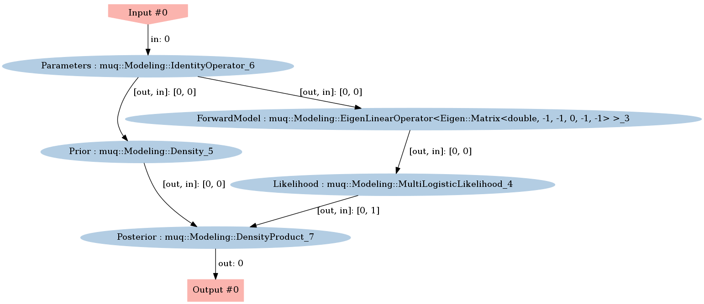
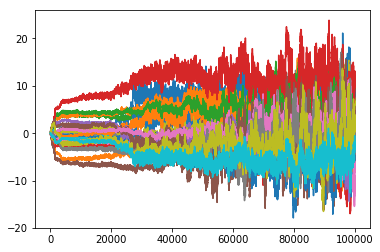
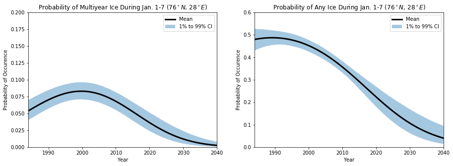

# Multinomial Logistic Regression for Sea Ice Age

Sea ice forms when saline ocean water freezes during cold winter months.  Note that sea ice is different than icebergs, which are chunks of freshwater glaciers that have broken off in to the ocean.

Sea ice is commonly divided into multiple categories, such as first year ice and multiyear ice.  Multiyear ice is defined as ice that has survived at least one summer season.  Interestingly, multiyear ice often is often signficantly different that first year ice.  It is typically less saline, rougher, and thicker. 

In `[1]`, satellite observations were used to estimate the age of ice across the Arctic basin from 1984 through 2016.  In this example, we will use their results to analyze the dependence of the January ice age on latitude, longitude, and time.

Let $y(x,t)$ denote the observed age (from `[1]`) at a location $x$ and time $t$.  The value of $y(x,t)$ can be one of three things:

$$
y(x,t) \in \{0,1,2\} = \{\text{No Ice},\,\, \text{First Year},\,\, \text{Multiyear} \}
$$

Now recall the components of a Bayesian inference problem:
1. The likelihood function, which is a statistical model describing the data
2. The prior distribution, which describes any prior information we have about the parameters

### Likelihood function
At each point in space and time, the probability of the ice being in state $i$ is given by

$$
P_i(x,t) = \mathbb{P}[\,y(x,t)=i\,]
$$

for $i\in \{0,1,2\}$.  Our statistical model for the data will model these probabilities using polynomial expansions. In particular, consider the new predictor variable $s_{i}(x,t;m)$ that takes the form

$$
s_{i}(x,t; m) = \exp\left[\sum_{j=1}^P m_{i,j} \Phi(x,t)\right]
$$

Normalizing the predictor variables allows us to model the probabilities:

$$
P_i(x,t; m) = \frac{s_{i}(x,t; m)}{\sum_{n=1}^3 s_{n}(x,t; m)}
$$

Assume we have $N$ independent observations $\{y_1,\ldots, y_N\}$ at locations $\{x_1,\ldots, x_N\}$ and times $\{t_1,\ldots, t_N\}$.  Under this assumption, the likelihood function takes the form 

$$
p(y | m) = \prod_{k=1}^N P_{y_k}(x_k, t_k; m) = \frac{s_{y_k}(x_k, t_k; m)}{\sum_{n=1}^3 s_{n}(x_k, t_k; m)}
$$

This approach of modeling the probabilities is commonly called multinomial logistic regression.  **The parameters we want to infer are the polynomial coefficients $m$.**

### Prior distribution


$$
m \sim N(0, I)
$$


### References
`[1]` Tschudi, M., C. Fowler, J. Maslanik, J. S. Stewart, and W. Meier. 2016. EASE-Grid Sea Ice Age, Version 3. Boulder, Colorado USA. NASA National Snow and Ice Data Center Distributed Active Archive Center. doi: https://doi.org/10.5067/PFSVFZA9Y85G. `[06/14/2018]`.

### Imports


```python
import sys
sys.path.insert(0,'/home/fenics/Installations/MUQ_INSTALL/lib')

from IPython.display import Image

import numpy as np
import matplotlib.pyplot as plt

# Helper functions pre-written for this problem
from IceAgeUtilities import *
from PlotUtilities import *

# MUQ Includes
import pymuqModeling as mm
import pymuqApproximation as ma
import pymuqUtilities as mu
import pymuqSamplingAlgorithms as ms
```

## Read Data


### Scaling for efficiency
In the original data, the observation locations are specified in terms of the latitude $x_{lat}$ and longitude $x_{lon}$.  However, the polynomial expansions used below are more numerically robust when the locations are scaled into $[0,1]$.  Moreover, the longitudes are periodic, so $s_i(x,t; m) = s_k(x+2\pi,t; m)$.  To rescale the positions, we therefore define $x$ as 

$$
x = \left[ \begin{array}{c} x_1, x_2 \end{array}\right] = \left[ \begin{array}{c} \frac{x_{lat} - \min(x_{lat})}{\max(x_{lat}) - \min(x_{lat})}\\ \frac{1}{2}\cos\left(2\pi \frac{x_{lon} - \min(x_{lon})}{\max(x_{lon}) - \min(x_{lon})}\right)+\frac{1}{2}  \end{array}\right].
$$

The time is scaled similarly

$$
t = \frac{t - \min(t)}{\max(t)-\min(t)}.
$$


```python
thinBy = 150
numClasses = 3 

timeRaw, latRaw, lonRaw, ages = ReadIceAges(thinBy, numClasses)

# Scale the independent variables to have domain [0,1]
minTime, maxTime = np.min(timeRaw), np.max(timeRaw)
minLat, maxLat = np.min(latRaw), np.max(latRaw)
minLon, maxLon = np.min(lonRaw), np.max(lonRaw)

time = (timeRaw-minTime)/(maxTime-minTime)
lat = (latRaw-minLat)/(maxLat-minLat)
lon = 0.5*np.cos( 2.0*np.pi*(lonRaw-minLon)/(maxLon - minLon) )+0.5

numObs = len(ages)
print('Using a total of %d age observations'%numObs)

```

    Using a total of 20502 age observations


## Plot data


```python
fig = plt.figure(figsize=(15,20))

ax = fig.add_subplot(131)
PlotAgeScatter(1984, timeRaw, latRaw, lonRaw, ages)

ax = fig.add_subplot(132)
PlotAgeScatter(2000, timeRaw, latRaw, lonRaw, ages)

ax = fig.add_subplot(133)
PlotAgeScatter(2016, timeRaw, latRaw, lonRaw, ages)
```


## Set up Multi-Logistic Regression
We assume that each predictor variable $s_i(x,t; m)$ is modeled with the same polynomial basis functions, resulting in 

$$
s_i(x,t;m) = \sum_{j=1}^P m_{i,j}\Phi_j(x,t)
$$

We collect all of the predictor variables into a single vector $s$ given by

$$
s = \left[\begin{array}{c} s_1(x_1, t_1; m)\\ s_2(x_1, t_1; m) \\ s_3(x_1, t_1; m) \\ s_1(x_2, t_2; m) \\ \vdots \\ s_1(x_N, t_N; m)\\ s_2(x_N, t_N; m) \\ s_3(x_N, t_N; m) \end{array}\right].
$$

The predictor variables can be related to the model parameters $m$ with a Vandermonde matrix $V$

$$
s = Vm,
$$

where the Vandermonde matrix is given by

$$
V = \left[
\begin{array}{ccccccccc}
\Phi_1(x_1,t_1) & \cdots & \Phi_P(x_1,t_1) & 0 & \cdots & 0 & 0 & \cdots & 0\\
0 & \cdots & 0 &\Phi_1(x_1,t_1) & \cdots & \Phi_P(x_1,t_1) &  0 & \cdots & 0\\
0 & \cdots & 0 &0 & \cdots & 0 & \Phi_1(x_1,t_1) & \cdots & \Phi_P(x_1,t_1) \\
\Phi_1(x_2,t_2) & \cdots & \Phi_P(x_2,t_2) & 0 & \cdots & 0 & 0 & \cdots & 0\\
0 & \cdots & 0 &\Phi_1(x_2,t_2) & \cdots & \Phi_P(x_2,t_2) &  0 & \cdots & 0\\
0 & \cdots & 0 &0 & \cdots & 0 & \Phi_1(x_2,t_2) & \cdots & \Phi_P(x_2,t_2) \\
\vdots & &\vdots & \vdots & &\vdots &\vdots & & \vdots \\
\Phi_1(x_N,t_1) & \cdots & \Phi_P(x_N,t_1) & 0 & \cdots & 0 & 0 & \cdots & 0\\
0 & \cdots & 0 &\Phi_1(x_N,t_1) & \cdots & \Phi_P(x_N,t_1) &  0 & \cdots & 0\\
0 & \cdots & 0 &0 & \cdots & 0 & \Phi_1(x_N,t_N) & \cdots & \Phi_P(x_N,t_N)
\end{array}\right]
$$

Because we have more than one output variable, this matrix is slightly different than the typical Vandermonde matrix used in linear regression.


```python
polyOrder = 2 # Maximum total order of the polynomial basis
numIndp = 3   # number of independent variables [time, lat, lon]

# Generate the set of total order limited multiindices
multiSet  = mu.MultiIndexFactory.CreateTotalOrder(numIndp,polyOrder)

# What type of polynomials do we want to use?  ProbabilistHermite
poly = ma.ProbabilistHermite()

# Construct the Vandermonde matrix for one class
partialV = ma.BasisExpansion([poly]*numIndp, multiSet).BuildVandermonde(np.hstack([time[:,None], lat[:,None], lon[:,None]]).T )

termsPerClass = partialV.shape[1]

# Construct the complete Vandermonde matrix by "stamping" the one-class Vandermonde matrix into V
V = np.zeros((numClasses*numObs, numClasses*termsPerClass))
for c in range(numClasses):
    V[c::numClasses, c*termsPerClass:(c+1)*termsPerClass] = partialV
```


```python
forwardModel = mm.DenseLinearOperator(V)
print('Number of model parameters = ', forwardModel.inputSizes[0])

likelihood = mm.MultiLogisticLikelihood(numClasses,ages)

prior = mm.Gaussian(np.zeros(V.shape[1]), 100*np.eye(V.shape[1])).AsDensity()
```

    Number of model parameters =  30


### Define the posterior density


```python
graph = mm.WorkGraph()

graph.AddNode(mm.IdentityOperator(V.shape[1]),"Parameters")
graph.AddNode(mm.DensityProduct(2), "Posterior")

# TODO: Define the posterior density using a WorkGraph
#  - Add nodes for the forward model and likelihood
#  - Add appropriate edges to build the posteror "diamond"

graph.AddNode(prior,"Prior")
graph.AddNode(forwardModel, "ForwardModel")
graph.AddNode(likelihood, "Likelihood")


graph.AddEdge("Parameters",0, "Prior",0)
graph.AddEdge("Parameters",0,"ForwardModel",0)
graph.AddEdge("ForwardModel",0, "Likelihood",0)
graph.AddEdge("Likelihood",0, "Posterior",1)
graph.AddEdge("Prior",0, "Posterior",0)
```


```python
graph.Visualize("PosteriorGraph.png")
Image(filename='PosteriorGraph.png') 
```





## Explore the posterior with MCMC


```python
problem = ms.SamplingProblem(graph.CreateModPiece("Posterior"))
```


```python
proposalOptions = dict()
proposalOptions['Method'] = 'AMProposal'
proposalOptions['ProposalVariance'] = 1e-3
proposalOptions['AdaptSteps'] = 100
proposalOptions['AdaptStart'] = 1000
proposalOptions['AdaptScale'] = 5e-2

kernelOptions = dict()
kernelOptions['Method'] = 'MHKernel'
kernelOptions['Proposal'] = 'ProposalBlock'
kernelOptions['ProposalBlock'] = proposalOptions

options = dict()
options['NumSamples'] = 100000
options['KernelList'] = 'Kernel1'
options['PrintLevel'] = 3
options['Kernel1'] = kernelOptions

mcmc = ms.SingleChainMCMC(options,problem)
```


```python
startPt = np.zeros(V.shape[1])
samps = mcmc.Run(startPt)
```

    Starting single chain MCMC sampler...
      10% Complete
        Block 0:
          Acceptance Rate = 14%
      20% Complete
        Block 0:
          Acceptance Rate = 18%
      30% Complete
        Block 0:
          Acceptance Rate = 21%
      40% Complete
        Block 0:
          Acceptance Rate = 24%
      50% Complete
        Block 0:
          Acceptance Rate = 26%
      60% Complete
        Block 0:
          Acceptance Rate = 27%
      70% Complete
        Block 0:
          Acceptance Rate = 29%
      80% Complete
        Block 0:
          Acceptance Rate = 30%
      90% Complete
        Block 0:
          Acceptance Rate = 31%
      100% Complete
        Block 0:
          Acceptance Rate = 32%
    Completed in 331.498 seconds.


```python
print('Generated a chain of length %d'%samps.size())
sampMat = samps.AsMatrix()

plt.plot(sampMat.T)
plt.show()
```

    Generated a chain of length 100000





## Sample the Posterior Predictive Distribution


```python
# Draw a single random posterior-predictive sample
burnIn = 50000
mcmcInd = np.random.randint(burnIn,options['NumSamples'],1)[0]

logProbs = forwardModel.Evaluate([sampMat[:,mcmcInd]])[0].reshape(-1,numClasses).T
NormalizeProbs(logProbs)
    
ageSamp = np.zeros(numObs)
for i in range(numObs):
    ageSamp[i] = np.random.choice(list(range(numClasses)), 1, p=np.exp(logProbs[:,i]))
```


```python
fig = plt.figure(figsize=(15,20))

ax = fig.add_subplot(131)
PlotAgeScatter(1984, timeRaw, latRaw, lonRaw, ageSamp)

ax = fig.add_subplot(132)
PlotAgeScatter(2000, timeRaw, latRaw, lonRaw, ageSamp)

ax = fig.add_subplot(133)
PlotAgeScatter(2016, timeRaw, latRaw, lonRaw, ageSamp)
```


## Study the Probability Over Time

Using the posterior samples, we can now investigate the posterior predictive distribution and answer questions like:
- What is the probability of seeing multiyear ice in the future?
- Looking to the future, how likely is it to see any sea ice?

To illustrate how to use the posterior predictive, we will focus on a single location: latitude 76, longitude 28, and years from 1984 to 2041.


#### Define the new latitude, longitudes, and times where we want to make predictions


```python
newTimeRaw = np.array(range(1984,2041))
newLatRaw = 76 * np.ones(newTimeRaw.shape[0])
newLonRaw = 28 * np.ones(newTimeRaw.shape[0])

# Scale the independent variables in the same way we did above
newTime = (newTimeRaw - minTime)/(maxTime-minTime)
newLat = (newLatRaw - minLat)/(maxLat-minLat)
newLon = 0.5 * np.cos( 2.0*np.pi * (newLonRaw-minLon)/(maxLon-minLon))+0.5
```

#### Construct the forward model for the predictor variables
$$
s_i(x,t;m) = \sum_{j=1}^P m_{i,j}\Phi_j(x,t)
$$


```python
# Construct the Vandermonde matrix for the new points
partialV = ma.BasisExpansion([poly]*numIndp, multiSet).BuildVandermonde(np.hstack([newTime[:,None], newLat[:,None], newLon[:,None]]).T )
V = np.zeros((numClasses*newTimeRaw.shape[0], numClasses*termsPerClass))
for c in range(numClasses):
    V[c::numClasses, c*termsPerClass:(c+1)*termsPerClass] = partialV
```

#### Compute the class probabilities
$$
P_i(x,t; m) = \frac{s_{i}(x,t; m)}{\sum_{n=1}^3 s_{n}(x,t; m)}
$$


```python
# Compute the marginal log-probabilities (integrating over model parameters)
probs = np.zeros((numClasses, newTimeRaw.shape[0], options['NumSamples']-burnIn ))
for i in range(burnIn,options['NumSamples']):
    currProb = np.exp(np.dot(V, sampMat[:,i]).reshape(-1,numClasses).T)
    currProb /= np.sum(currProb,axis=0)
    probs[:,:,i-burnIn] = currProb
```

#### Plot the results


```python
## Plot the probability of multiyear ice being present
fig, axs = plt.subplots(ncols=2, figsize=(15,5))

axs[0].fill_between(newTimeRaw,np.percentile(probs[2,:,:],1,axis=1),np.percentile(probs[2,:,:],99,axis=1), alpha=0.4, edgecolor='None', label='1% to 99% CI')
axs[0].plot(newTimeRaw, np.mean(probs[2,:,:],axis=1), 'k', linewidth=3, label='Mean')

axs[0].set_title('Probability of Multiyear Ice During Jan. 1-7 ($%0.0f^\circ N$, $%0.0f^\circ E$)'%(newLatRaw[0], newLonRaw[0]))
axs[0].set_xlabel('Year')
axs[0].set_ylabel('Probability of Occurence')
axs[0].set_ylim([0,0.2])
axs[0].set_xlim([1984,2040])
axs[0].legend()

## Plot the probability of any ice being present
axs[1].fill_between(newTimeRaw,np.percentile(1-probs[0,:,:],1,axis=1),np.percentile(1-probs[0,:,:],99,axis=1), alpha=0.4, edgecolor='None', label='1% to 99% CI') 
axs[1].plot(newTimeRaw, np.mean(1.0-probs[0,:,:],axis=1), 'k', linewidth=3, label='Mean')

axs[1].set_title('Probability of Any Ice During Jan. 1-7 ($%0.0f^\circ N$, $%0.0f^\circ E$)'%(newLatRaw[0], newLonRaw[0]))
axs[1].set_xlabel('Year')
axs[1].set_ylabel('Probability of Occurence')
axs[1].set_ylim([0,0.6])
axs[1].set_xlim([1984,2040])
axs[1].legend()

plt.show()
```




