# Coefficient field inversion in an elliptic partial differential equation

We consider the estimation of a coefficient in an elliptic partial
differential equation as a model problem. Depending on the
interpretation of the unknowns and the type of measurements, this
model problem arises, for instance, in inversion for groundwater flow
or heat conductivity.  It can also be interpreted as finding a
membrane with a certain spatially varying stiffness. Let
$$\Omega\subset\mathbb{R}^n$$, $$n\in\{1,2,3\}$$ be an open, bounded
domain and consider the following problem:

$$
\min_{m} J(m):=\frac{1}{2}\int_\Omega (u-u_d)^2\, dx + \frac{\gamma}{2}\int_\Omega |\nabla m|^2\,dx,
$$

where $$u$$ is the solution of

$$
\begin{split}
\quad -\nabla\cdot(e^m\nabla u) &= f \text{ in }\Omega,\\
u &= 0 \text{ on }\partial\Omega.
\end{split}
$$

Here $$m\in \mathcal{M}:=\{m\in H^1(\Omega) \bigcap L^{\infty}(\Omega)\}$$ denotes the unknown coefficient field, $$u \in \mathcal{V}:= H^1_0(\Omega)$$ the state variable, $$u_d$$ the (possibly noisy) data, $$f\in H^{-1}(\Omega)$$ a given volume force, and $$\gamma\ge 0$$ the regularization parameter.

### The variational (or weak) form of the state equation:

Find $$u\in \mathcal{V}$$ such that 

$$(e^m\nabla u,\nabla v) - (f,v) = 0, \text{ for all } v\in \mathcal{V},$$

where $$\mathcal{V}$$ is the space of functions vanishing on $$\partial\Omega$$ with square integrable derivatives.

Above, $$(\cdot\,\cdot)$$ denotes the $$L^2$$-inner product, i.e, for scalar functions $$u,v$$ defined on $$\Omega$$ we write 

$$(u,v) := \int_\Omega u(x) v(x) \,dx, $$

and similarly for vector functions $$\boldsymbol{u}, \boldsymbol{v}$$ defined on $$\Omega$$ we write

$$(\boldsymbol{u},\boldsymbol{v}) := \int_\Omega \boldsymbol{u}(x) \cdot \boldsymbol{v}(x) \,dx.$$

### Gradient evaluation:

The Lagrangian functional $$\mathscr{L}: \mathcal{V} \times \mathcal{M} \times \mathcal{V} \rightarrow \mathbb{R}$$ is given by

$$
\mathscr{L}(u,m,p):= \frac{1}{2}(u-u_d,u-u_d) +
\frac{\gamma}{2}(\nabla m, \nabla m) +  (e^m\nabla u,\nabla p) - (f,p).
$$

Then the gradient of the cost functional $$\mathcal{J}(m)$$ with respect to the parameter $$m$$ is

$$
    \mathcal{G}(m)(\tilde m) := \gamma(\nabla m, \nabla \tilde{m}) +
     (\tilde{m} e^m\nabla u, \nabla p) \quad \forall \tilde{m} \in \mathcal{M},
$$

where $$u \in \mathcal{V}$$ is the solution of the forward problem,

$$ \mathscr{L}_p(u,m,p)(\tilde{p})  := (e^m\nabla u, \nabla \tilde{p}) - (f,\tilde{p}) = 0
\quad \forall \tilde{p} \in \mathcal{V}, $$

and $$p \in \mathcal{V}$$ is the solution of the adjoint problem,

$$ \mathscr{L}_u(u,m,p)(\tilde{u}) := (e^m\nabla p, \nabla \tilde{u}) + (u-u_d,\tilde{u}) = 0
\quad \forall \tilde{u} \in \mathcal{V}.$$

### Hessian action:

To evaluate the action $$\mathcal{H}(m)(\hat{m})$$ of the Hessian is a given direction $$\hat{m}$$ , we consider variations of the meta-Lagrangian functional

$$
\begin{aligned}
\mathscr{L}^H(u,m,p; \hat{u}, \hat{m}, \hat{p}) := & {} & {} \\
{} & \gamma(\nabla m, \nabla \tilde{m}) + (\tilde{m}e^m\nabla u, \nabla p) & \text{gradient}\\
{} & + (e^m\nabla u, \nabla \hat{p}) - (f,\hat{p}) & \text{forward eq}\\
{} & + (e^m\nabla p, \nabla \hat{u}) + (u-u_d,\hat{u}) & \text{adjoint eq}.
\end{aligned}
$$

Then action of the Hessian is a given direction $$\hat{m}$$ is

$$
\begin{aligned}
(\tilde{m}, \mathcal{H}(m)(\hat{m}) ) & := \mathscr{L}^H_m(u,m,p; \hat{u}, \hat{m}, \hat{p})(\tilde{m}) \\
{} & =
(\tilde{m} e^m \nabla \hat{u}, \nabla{p}) + \gamma (\nabla \hat{m}, \nabla \tilde{m}) + (\tilde{m} \hat{m} e^m \nabla u, \nabla p) + (\tilde{m} e^m \nabla u, \nabla \hat{p}) \quad \forall \tilde{m} \in \mathcal{M},
\end{aligned}
$$

where 

- $$u\in \mathcal{V}$$ and $$p \in \mathcal{V}$$ are the solution of the forward and adjoint problem, respectively;

- $$\hat{u} \in \mathcal{V}$$ is the solution of the incremental forward problem,

$$
\mathscr{L}^H_p(u,m,p; \hat{u}, \hat{m}, \hat{p})(\tilde{p}) := (e^m \nabla \hat{u}, \nabla \tilde{p}) + (\hat{m} e^m \, \nabla u, \nabla \tilde p) = 0 \quad \forall \tilde{p} \in \mathcal{V};
$$


- and $$\hat{p} \in \mathcal{V}$$ is the solution of the incremental adjoint problem,
$$
\mathscr{L}^H_u(u,m,p; \hat{u}, \hat{m}, \hat{p})(\tilde{u}) := (\hat{u}, \tilde{u}) + (\hat{m} e^m\nabla p, \nabla \tilde{u}) + (e^m \nabla \tilde u, \nabla \hat{p}) = 0 \quad \forall \tilde{u} \in \mathcal{V}.
$$

### Inexact Newton-CG:

Written in abstract form, the Newton Method computes an update direction $$\hat{m}_k$$ by solving the linear system 

$$
(\tilde{m}, \mathcal{H}(m_k)(\hat{m}_k) ) = -\mathcal{G}(m_k)(\tilde m) \quad \forall \tilde{m} \in H^1(\Omega),
$$

where the evaluation of the gradient $$\mathcal{G}(m_k)$$ involve the solution $$u_k$$ and $$p_k$$ of the forward and adjoint problem (respectively) for $$m = m_k$$.
Similarly, the Hessian action $$\mathcal{H}(m_k)(\hat{m}_k)$$ requires to additional solve the incremental forward and adjoint problems.

### Discrete Newton system:
$$
\def\tu{\tilde u}
\def\tm{\tilde m}
\def\tp{\tilde p}
\def\hu{\hat u}
\def\hp{\hat p}
\def\hm{\hat m}
\def\bu{ {\bf u} }
\def\bm{ {\bf m} }
\def\bp{ {\bf p} }
\def\btu{ {\bf \tilde u} }
\def\btm{ {\bf \tilde m} }
\def\btp{ {\bf \tilde p} }
\def\bhu{ {\bf \hat u} }
\def\bhm{ {\bf \hat m} }
\def\bhp{ {\bf \hat p} }
\def\bg{ {\bf g} }
\def\bA{ {\bf A} }
\def\bC{ {\bf C} }
\def\bH{ {\bf H} }
\def\bR{ {\bf R} }
\def\bW{ {\bf W} }
$$

Let us denote the vectors corresponding to the discretization of the functions $$u_k, m_k, p_k$$ by $$\bu_k, \bm_k, \bp_k$$ and of the functions $$\hu_k, \hm_k, \hp_k$$ by $$\bhu_k, \bhm_k,\bhp_k$$.

Then, the discretization of the above system is given by the following symmetric linear system:

$$
  \bH_k \, \bhm_k = -\bg_k.
$$

The gradient $$\bg_k$$ is computed using the following three steps

- Given $$\bm_k$$ we solve the forward problem

$$ \bA_k \bu_k = {\bf f}, $$

where $$\bA_k \bu_k$$ stems from the discretization $$(e^{m_k}\nabla u_k, \nabla \tilde{p})$$, and $${\bf f}$$ stands for the discretization of the right hand side $$f$$.

- Given $$\bm_k$$ and $$\bu_k$$ solve the adjoint problem

$$ \bA_k^T \bp_k = - \bW_{\scriptsize\mbox{uu}}\,(\bu_k-\bu_d) $$

where $$\bA_k^T \bp_k$$ stems from the discretization of $$(e^{m_k}\nabla \tilde{u}, \nabla p_k)$$, $$\bW_{\scriptsize\mbox{uu}}$$ is the mass matrix corresponding to the $$L^2$$ inner product in the state space, and $$\bu_d$$ stems from the data.

- Define the gradient 

$$ \bg_k = \bR \bm_k + \bC_k^T \bp_k, $$

where $$\bR$$ is the matrix stemming from discretization of the regularization operator $$\gamma ( \nabla \hat{m}, \nabla \tilde{m})$$, and $$\bC_k$$ stems from discretization of the term $$(\tilde{m} e^{m_k} \, \nabla u_k, \nabla p_k)$$.

Similarly the action of the Hessian $$\bH_k \, \bhm_k$$ in a direction $$\bhm_k$$ (by using the CG algorithm we only need the action of $$\bH_k$$ to solve the Newton step) is given by

- Solve the incremental forward problem

$$ \bA_k \bhu_k = -\bC_k \bhm_k, $$

where $$\bC_k \bm_k$$ stems from discretization of $$(\hat{m} e^{m_k} \nabla u_k, \nabla \tilde p)$$.

- Solve the incremental adjoint problem

$$ \bA_k^T \bhp_k = -(\bW_{\scriptsize\mbox{uu}} \bhu_k + \bW_{\scriptsize\mbox{um}}\,\bhm_k),$$

where $$\bW_{\scriptsize\mbox{um}}\,\bhm_k$$ stems for the discretization of $$(\hat{m}_k e^{m_k}\nabla p_k, \nabla \tilde{u})$$.

- Define the Hessian action

$$
  \bH_k \, \bhm = \underbrace{(\bR + \bW_{\scriptsize\mbox{mm}})}_{\text{Hessian of the regularization}} \bhm +
    \underbrace{(\bC_k^{T}\bA_k^{-T} (\bW_{\scriptsize\mbox{uu}}
    \bA_k^{-1} \bC_k - \bW_{\scriptsize\mbox{um}}) -
    \bW_{\scriptsize\mbox{mu}} \bA_k^{-1}
    \bC_k)}_{\text{Hessian of the data misfit}}\;\bhm.
$$

### Goals:

By the end of this notebook, you should be able to:

- solve the forward and adjoint Poisson equations
- understand the inverse method framework
- visualise and understand the results
- modify the problem and code

### Mathematical tools used:

- Finite element method
- Derivation of gradiant and Hessian via the adjoint method
- inexact Newton-CG
- Armijo line search

### Import dependencies


```python
import dolfin as dl
import numpy as np

from hippylib import *

import logging

import matplotlib.pyplot as plt
%matplotlib inline

logging.getLogger('FFC').setLevel(logging.WARNING)
logging.getLogger('UFL').setLevel(logging.WARNING)
dl.set_log_active(False)
```

### Model set up:

As in the introduction, the first thing we need to do is set up the numerical model.  In this cell, we set the mesh, the finite element functions $$u, m, p$$ corresponding to state, parameter and adjoint variables, and the corresponding test functions and the parameters for the optimization.

The true parameter ``mtrue`` is the finite element interpolant of the function

$$ m_{\rm true} = \left\{ \begin{array}{l} \ln 4 \; \forall \,(x,y) \, {\rm s.t.}\, \sqrt{ (x-.5)^2 + (y-.5)^2} \leq 0.2 \\ \ln 8 \; {\rm otherwise}. \end{array}\right. $$

The forcing term ``f`` and the boundary conditions ``u0`` for the forward problem are

$$ f = 1 \; \forall {\bf x} \in \Omega, \quad u = 0 \; \forall {\bf x} \in \partial \Omega. $$


```python
# create mesh and define function spaces
nx = 64
ny = 64
mesh = dl.UnitSquareMesh(nx, ny)
Vm = dl.FunctionSpace(mesh, 'Lagrange', 1)
Vu = dl.FunctionSpace(mesh, 'Lagrange', 2)

# The true and initial guess inverted parameter
mtrue = dl.interpolate(dl.Expression('std::log( 8. - 4.*(pow(x[0] - 0.5,2) + pow(x[1] - 0.5,2) < pow(0.2,2) ) )', degree=5), Vm)

# define function for state and adjoint
u = dl.Function(Vu)
m = dl.Function(Vm)
p = dl.Function(Vu)

# define Trial and Test Functions
u_trial, m_trial, p_trial = dl.TrialFunction(Vu), dl.TrialFunction(Vm), dl.TrialFunction(Vu)
u_test,  m_test,  p_test  = dl.TestFunction(Vu),  dl.TestFunction(Vm),  dl.TestFunction(Vu)

# initialize input functions
f = dl.Constant(1.0)
u0 = dl.Constant(0.0)

# plot
plt.figure(figsize=(15,5))
nb.plot(mesh,subplot_loc=121, mytitle="Mesh", show_axis='on')
nb.plot(mtrue,subplot_loc=122, mytitle="True parameter field")
plt.show()
```


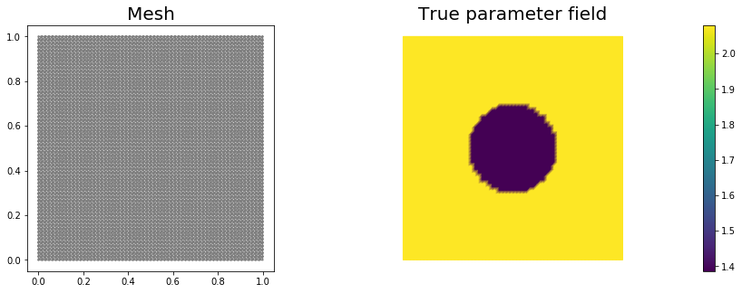


```python
# set up dirichlet boundary conditions
def boundary(x,on_boundary):
    return on_boundary

bc_state = dl.DirichletBC(Vu, u0, boundary)
bc_adj = dl.DirichletBC(Vu, dl.Constant(0.), boundary)
```

### Set up synthetic observations:

- Propose a coefficient field $$m_{\rm true}$$ shown above
- The weak form of the PDE:

    Find $$u\in \mathcal{V}$$ such that 
    $$\underbrace{(e^{m_{\rm true}}\nabla u,\nabla v)}_{\; := \; a_{\rm true}} - \underbrace{(f,v)}_{\; := \;L_{\rm true}} = 0, \text{ for all } v\in \mathcal{V}.$$

- Perturb the solution: $$u = u + \eta$$, where $$\eta \sim \mathcal{N}(0, \sigma^2)$$


```python
# noise level
noise_level = 0.05

# weak form for setting up the synthetic observations
a_true = dl.inner(dl.exp(mtrue) * dl.grad(u_trial), dl.grad(u_test)) * dl.dx
L_true = f * u_test * dl.dx

# solve the forward/state problem to generate synthetic observations
A_true, b_true = dl.assemble_system(a_true, L_true, bc_state)

utrue = dl.Function(Vu)
dl.solve(A_true, utrue.vector(), b_true)

ud = dl.Function(Vu)
ud.assign(utrue)

# perturb state solution and create synthetic measurements ud
# ud = u + ||u||/SNR * random.normal
MAX = ud.vector().norm("linf")
noise = dl.Vector()
A_true.init_vector(noise,1)
noise.set_local( noise_level * MAX * np.random.normal(0, 1, len(ud.vector().get_local())) )
bc_adj.apply(noise)

ud.vector().axpy(1., noise)

# plot
nb.multi1_plot([utrue, ud], ["State solution with mtrue", "Synthetic observations"])
plt.show()
```


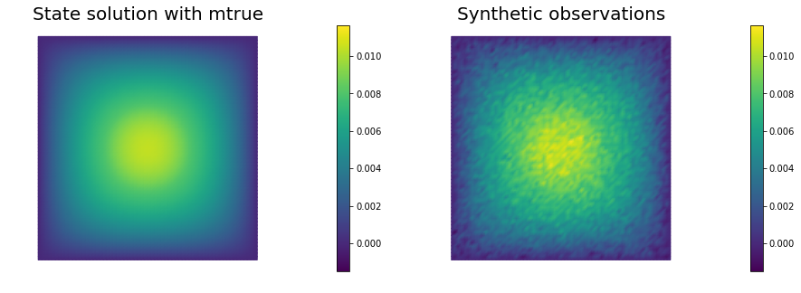


### The cost function evaluation:

$$
J(m):=\underbrace{\frac{1}{2}\int_\Omega (u-u_d)^2\, dx}_{\text{misfit} } + \underbrace{\frac{\gamma}{2}\int_\Omega|\nabla m|^2\,dx}_{\text{reg}}
$$


```python
# regularization parameter
gamma = 1e-8

# define cost function
def cost(u, ud, m,gamma):
    reg = 0.5*gamma * dl.assemble( dl.inner(dl.grad(m), dl.grad(m))*dl.dx ) 
    misfit = 0.5 * dl.assemble( (u-ud)**2*dl.dx)
    return [reg + misfit, misfit, reg]
```

### Setting up the variational form for the state/adjoint equations and gradient evaluation

Below we define the variational forms that appears in the the state/adjoint equations and gradient evaluations.

Specifically,

- `a_state`, `L_state` stand for the bilinear and linear form of the state equation, repectively;
- `a_adj`, `L_adj` stand for the bilinear and linear form of the adjoint equation, repectively;
- `CTvarf`, `gradRvarf` stand for the contributions to the gradient coming from the PDE and the regularization, respectively.

We also build the *mass* matrix $$M$$ that is used to discretize the $$L^2(\Omega)$$ inner product.


```python
# weak form for setting up the state equation
a_state = dl.inner(dl.exp(m) * dl.grad(u_trial), dl.grad(u_test)) * dl.dx
L_state = f * u_test * dl.dx

# weak form for setting up the adjoint equation
a_adj = dl.inner(dl.exp(m) * dl.grad(p_trial), dl.grad(p_test)) * dl.dx
L_adj = -dl.inner(u - ud, p_test) * dl.dx

# weak form for gradient
CTvarf    = dl.inner(dl.exp(m)*m_test*dl.grad(u), dl.grad(p)) * dl.dx
gradRvarf = gamma*dl.inner(dl.grad(m), dl.grad(m_test))*dl.dx

# L^2 weighted inner product
M_varf   = dl.inner(m_trial, m_test) * dl.dx
M = dl.assemble(M_varf)
```

### Initial guess
We solve the state equation and compute the cost functional for the initial guess of the parameter ``m0``


```python
m0 = dl.interpolate(dl.Constant(np.log(4.) ), Vm )

m.assign(m0)

# solve state equation
state_A, state_b = dl.assemble_system (a_state, L_state, bc_state)
dl.solve (state_A, u.vector(), state_b)

# evaluate cost
[cost_old, misfit_old, reg_old] = cost(u, ud, m, gamma)

# plot
plt.figure(figsize=(15,5))
nb.plot(m,subplot_loc=121, mytitle="m0", vmin=mtrue.vector().min(), vmax=mtrue.vector().max())
nb.plot(u,subplot_loc=122, mytitle="u(m0)")
plt.show()
```


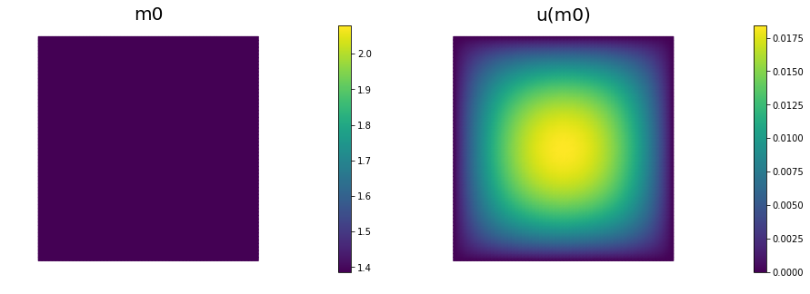


### Variational forms for Hessian action

We define the following variational forms that are needed for the Hessian evaluation

- `W_varf`, `R_varf` are the second variation of the data-misfit and regularization component of the cost functional respectively (note since `W_varf`, `R_varf` are independent of $$u$$, $$m$$, $$p$$ they can be preassembled);

- `C_varf` is the second variation of the PDE with respect to $$p$$ and $$m$$;

- `Wum_varf` is the second variation of the PDE with respect to $$u$$ and $$m$$;

- `Wmm_varf` is the second variation of the PDE with respect to $$m$$.

> **Note**: Since the forward problem is linear, the bilinear forms for the incremental state and adjoint equations are the same as the bilinear forms for the state and adjoint equations, respectively.


```python
W_varf   = dl.inner(u_trial, u_test) * dl.dx
R_varf   = dl.Constant(gamma) * dl.inner(dl.grad(m_trial), dl.grad(m_test)) * dl.dx

C_varf   = dl.inner(dl.exp(m) * m_trial * dl.grad(u), dl.grad(u_test)) * dl.dx
Wum_varf = dl.inner(dl.exp(m) * m_trial * dl.grad(p_test), dl.grad(p)) * dl.dx
Wmm_varf = dl.inner(dl.exp(m) * m_trial * m_test *  dl.grad(u),  dl.grad(p)) * dl.dx

# Assemble constant matrices
W = dl.assemble(W_varf)
R = dl.assemble(R_varf)
```

### Hessian action on a vector $$\bhm$$:

Here we describe how to apply the Hessian operator to a vector $$\bhm$$. For an opportune choice of the regularization, the Hessian operator evaluated in a neighborhood of the solution is positive define, whereas far from the solution the reduced Hessian may be indefinite. On the constrary, the Gauss-Newton approximation of the Hessian is always positive defined.

For this reason, it is beneficial to perform a few initial Gauss-Newton steps (5 in this particular example) to accelerate the convergence of the inexact Newton-CG algorithm.

The Hessian action reads:
$$
\begin{align}
\bhu &= -\bA^{-1} \bC \bhm\, & \text{incremental forward}\\
\bhp &= -\bA^{-T} (\bW_{\scriptsize\mbox{uu}} \bhu +
\bW_{\scriptsize\mbox{um}}\,\bhm) & \text{incremental adjoint}\\
\bH \bhm &= (\bR + \bW_{\scriptsize\mbox{mm}})\bhm + \bC^T \bhp + \bW_{\scriptsize\mbox{mu}} \bhu.
\end{align}
$$

The Gauss-Newton Hessian action is obtained by dropping the second derivatives operators $$\bW_{\scriptsize\mbox{um}}\,\bhm$$, $$\bW_{\scriptsize\mbox{mm}}\bf \bhm$$, and $$\bW_{\scriptsize\mbox{mu}} \bhu$$:

$$
\begin{align}
\bhu &= -\bA^{-1} \bC \bf \bhm\, & \text{incremental forward}\\
\bhp &= -\bA^{-T} \bW_{\scriptsize\mbox{uu}} \bhu & \text{incremental adjoint}\\
\bH_{\rm GN} \bhm &= \bR \bhm + \bC^T \bhp.
\end{align}
$$


```python
# Class HessianOperator to perform Hessian apply to a vector
class HessianOperator():
    cgiter = 0
    def __init__(self, R, Wmm, C, A, adj_A, W, Wum, bc0, use_gaussnewton=False):
        self.R = R
        self.Wmm = Wmm
        self.C = C
        self.A = A
        self.adj_A = adj_A
        self.W = W
        self.Wum = Wum
        self.bc0 = bc0
        self.use_gaussnewton = use_gaussnewton
        
        # incremental state
        self.du = dl.Vector()
        self.A.init_vector(self.du,0)
        
        #incremental adjoint
        self.dp = dl.Vector()
        self.adj_A.init_vector(self.dp,0)
        
        # auxiliary vector
        self.Wum_du = dl.Vector()
        self.Wum.init_vector(self.Wum_du, 1)
        
    def init_vector(self, v, dim):
        self.R.init_vector(v,dim)

    # Hessian performed on v, output as generic vector y
    def mult(self, v, y):
        self.cgiter += 1
        y.zero()
        if self.use_gaussnewton:
            self.mult_GaussNewton(v,y)
        else:
            self.mult_Newton(v,y)
            
    # define (Gauss-Newton) Hessian apply H * v
    def mult_GaussNewton(self, v, y):
        
        #incremental forward
        rhs = -(self.C * v)
        self.bc0.apply(rhs)
        dl.solve (self.A, self.du, rhs)
        
        #incremental adjoint
        rhs = - (self.W * self.du)
        self.bc0.apply(rhs)
        dl.solve (self.adj_A, self.dp, rhs)
                
        # Misfit term
        self.C.transpmult(self.dp, y)
        
        if self.R:
            Rv = self.R*v
            y.axpy(1, Rv)
        
    # define (Newton) Hessian apply H * v
    def mult_Newton(self, v, y):
        
        #incremental forward
        rhs = -(self.C * v)
        self.bc0.apply(rhs)
        dl.solve (self.A, self.du, rhs)
        
        #incremental adjoint
        rhs = -(self.W * self.du) -  self.Wum * v
        self.bc0.apply(rhs)
        dl.solve (self.adj_A, self.dp, rhs)
                
        #Misfit term
        self.C.transpmult(self.dp, y)
        
        self.Wum.transpmult(self.du, self.Wum_du)
        y.axpy(1., self.Wum_du)
        
        y.axpy(1., self.Wmm*v)
        
        #Reg/Prior term
        if self.R:
            y.axpy(1., self.R*v)
        
```

## The inexact Newton-CG optimization with Armijo line search:

We solve the constrained optimization problem using the inexact Newton-CG method with Armijo line search.

The stopping criterion is based on a relative reduction of the norm of the gradient (i.e. $$\frac{\|g_{n}\|}{\|g_{0}\|} \leq \tau$$).

First, we compute the gradient by solving the state and adjoint equation for the current parameter $$m$$, and then substituing the current state $$u$$, parameter $$m$$ and adjoint $$p$$ variables in the weak form expression of the gradient:
$$ (g, \tilde{m}) = \gamma(\nabla m, \nabla \tilde{m}) +(\tilde{m}\nabla u, \nabla p).$$

Then, we compute the Newton direction $$\hat m$$ by iteratively solving $$\mathcal{H} {\hat m} = -g$$.
The Newton system is solved inexactly by early termination of conjugate gradient iterations via Eisenstat–Walker (to prevent oversolving) and Steihaug  (to avoid negative curvature) criteria. 

> Usually, one uses the regularization matrix $$R$$ as preconditioner for the Hessian system, however since $$R$$ is singular (the constant vector is in the null space of $$R$$), here we use $$P = R + \frac{\gamma}{10} M$$, where $$M$$ is the mass matrix in parameter space.

Finally, the Armijo line search uses backtracking to find $$\alpha$$ such that a sufficient reduction in the cost functional is achieved.
More specifically, we use backtracking to find $$\alpha$$ such that:
$$J( m + \alpha \hat m ) \leq J(m) + \alpha c_{\rm armijo} (\hat m,g). $$


```python
# define parameters for the optimization
tol = 1e-8
c = 1e-4
maxiter = 12
plot_on = False

# initialize iter counters
iter = 1
total_cg_iter = 0
converged = False

# initializations
g, m_delta = dl.Vector(), dl.Vector()
R.init_vector(m_delta,0)
R.init_vector(g,0)

m_prev = dl.Function(Vm)

print( "Nit   CGit   cost          misfit        reg           sqrt(-G*D)    ||grad||       alpha  tolcg" )

while iter <  maxiter and not converged:

    # solve the adoint problem
    adjoint_A, adjoint_RHS = dl.assemble_system(a_adj, L_adj, bc_adj)
    dl.solve(adjoint_A, p.vector(), adjoint_RHS)

    # evaluate the  gradient
    MG = dl.assemble(CTvarf + gradRvarf)

    # calculate the L^2 norm of the gradient
    dl.solve(M, g, MG)
    grad2 = g.inner(MG)
    gradnorm = np.sqrt(grad2)

    # set the CG tolerance (use Eisenstat–Walker termination criterion)
    if iter == 1:
        gradnorm_ini = gradnorm
    tolcg = min(0.5, np.sqrt(gradnorm/gradnorm_ini))
    
    # assemble W_um and W_mm
    C   = dl.assemble(C_varf)
    Wum = dl.assemble(Wum_varf)
    Wmm = dl.assemble(Wmm_varf)

    # define the Hessian apply operator (with preconditioner)
    Hess_Apply = HessianOperator(R, Wmm, C, state_A, adjoint_A, W, Wum, bc_adj, use_gaussnewton=(iter<6) )
    P = R + 0.1*gamma * M
    Psolver = dl.PETScKrylovSolver("cg", amg_method())
    Psolver.set_operator(P)
    
    solver = CGSolverSteihaug()
    solver.set_operator(Hess_Apply)
    solver.set_preconditioner(Psolver)
    solver.parameters["rel_tolerance"] = tolcg
    solver.parameters["zero_initial_guess"] = True
    solver.parameters["print_level"] = -1

    # solve the Newton system H a_delta = - MG
    solver.solve(m_delta, -MG)
    total_cg_iter += Hess_Apply.cgiter
    
    # linesearch
    alpha = 1
    descent = 0
    no_backtrack = 0
    m_prev.assign(m)
    while descent == 0 and no_backtrack < 10:
        m.vector().axpy(alpha, m_delta )

        # solve the state/forward problem
        state_A, state_b = dl.assemble_system(a_state, L_state, bc_state)
        dl.solve(state_A, u.vector(), state_b)

        # evaluate cost
        [cost_new, misfit_new, reg_new] = cost(u, ud, m, gamma)

        # check if Armijo conditions are satisfied
        if cost_new < cost_old + alpha * c * MG.inner(m_delta):
            cost_old = cost_new
            descent = 1
        else:
            no_backtrack += 1
            alpha *= 0.5
            m.assign(m_prev)  # reset a

    # calculate sqrt(-G * D)
    graddir = np.sqrt(- MG.inner(m_delta) )

    sp = ""
    print( "%2d %2s %2d %3s %8.5e %1s %8.5e %1s %8.5e %1s %8.5e %1s %8.5e %1s %5.2f %1s %5.3e" % \
        (iter, sp, Hess_Apply.cgiter, sp, cost_new, sp, misfit_new, sp, reg_new, sp, \
         graddir, sp, gradnorm, sp, alpha, sp, tolcg) )

    if plot_on:
        nb.multi1_plot([m,u,p], ["m","u","p"], same_colorbar=False)
        plt.show()
    
    # check for convergence
    if gradnorm < tol and iter > 1:
        converged = True
        print( "Newton's method converged in ",iter,"  iterations" )
        print( "Total number of CG iterations: ", total_cg_iter )
        
    iter += 1
    
if not converged:
    print( "Newton's method did not converge in ", maxiter, " iterations" )
```

    Nit   CGit   cost          misfit        reg           sqrt(-G*D)    ||grad||       alpha  tolcg
     1     1     6.60543e-07   6.60543e-07   5.73978e-14   5.03905e-03   6.10768e-05    1.00   5.000e-01
     2     1     1.09971e-07   1.09970e-07   1.05944e-13   1.05263e-03   7.93019e-06    1.00   3.603e-01
     3     1     1.06533e-07   1.06533e-07   1.15300e-13   8.29208e-05   6.72435e-07    1.00   1.049e-01
     4    10     9.42019e-08   9.08131e-08   3.38884e-09   1.51655e-04   2.67978e-07    1.00   6.624e-02
     5     1     9.41547e-08   9.07658e-08   3.38892e-09   9.72005e-06   6.45440e-08    1.00   3.251e-02
     6    15     9.40734e-08   9.02137e-08   3.85976e-09   1.27564e-05   2.58250e-08    1.00   2.056e-02
     7    12     9.40734e-08   9.02163e-08   3.85710e-09   1.81223e-07   5.38361e-10    1.00   2.969e-03
    Newton's method converged in  7   iterations
    Total number of CG iterations:  41


```python
nb.multi1_plot([mtrue, m], ["mtrue", "m"])
nb.multi1_plot([u,p], ["u","p"], same_colorbar=False)
plt.show()
```


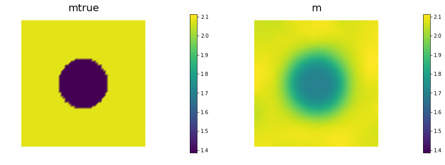


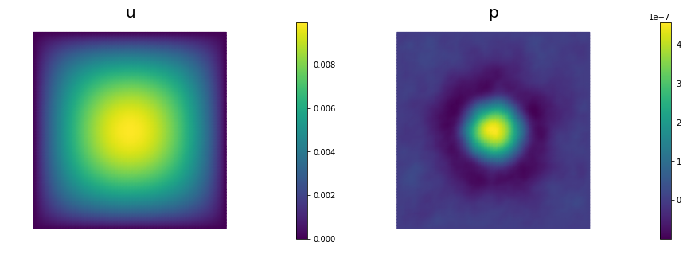


### The generalized eigenvalues and eigenvectors of the Hessian misfit  

We used the *double pass* randomized algorithm to compute the generalized eigenvalues and eigenvectors of the Hessian misfit.
In particular, we solve

$$ H_{\rm misfit} \hat{\bf m}_i = \lambda_i R \hat{\bf v}_i. $$

The Figure shows the largest *k* generalized eigenvectors of the Hessian misfit.
The effective rank of the Hessian misfit is the number of eigenvalues above the red line ($$y=1$$).
The effective rank is independent of the mesh size.

> **Note**: Since $$R$$ is singular (the constant are in the null space of $$R$$), we will add a small mass matrix $$M$$ to $$R$$ and use $$P = R + \frac{\gamma}{10}M$$ instead.


```python
Hmisfit = HessianOperator(None, Wmm, C, state_A, adjoint_A, W, Wum, bc_adj, use_gaussnewton=False)
k = 50
p = 20
print( "Double Pass Algorithm. Requested eigenvectors: {0}; Oversampling {1}.".format(k,p) )

Omega = MultiVector(m.vector(), k+p)
parRandom.normal(1., Omega)
lmbda, evecs = doublePassG(Hmisfit, P, Psolver, Omega, k)

plt.plot(range(0,k), lmbda, 'b*', range(0,k+1), np.ones(k+1), '-r')
plt.yscale('log')
plt.xlabel('number')
plt.ylabel('eigenvalue')

nb.plot_eigenvectors(Vm, evecs, mytitle="Eigenvector", which=[0,1,2,5,10,15])
```

    Double Pass Algorithm. Requested eigenvectors: 50; Oversampling 20.


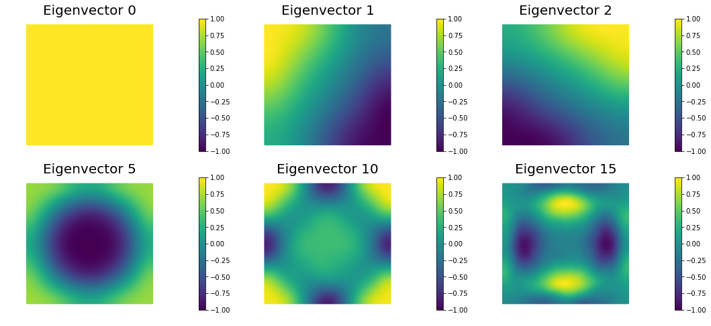


## Hands on

### Question 1

> Report the number of inexact Newton and of total CG iterations for a discretization of the domain with $$8 \times 8$$, $$16 \times 16$$, $$32 \times 32$$, $$64 \times 64$$ finite elements and give the number of unknowns used to discretize the log diffusivity field m for each of these meshes. Discuss how the number of iterations changes as the inversion parameter mesh is refined, i.e., as the parameter dimension increases. Is inexact Newton-CG method scalable with respect to the parameter dimension?

The number of inexact Newton and of total CG iterations is independent of the resolution of the spacial discretization. This means that inexact Newton-CG method scalable with respect to the parameter dimension, i.e. the cost of solving the inverse problem (measured in terms of number of PDE solves) is independent of the mesh size.

### Question 2

> Compute the generalized eigenvalues and eigenvectors of the Hessian misfit at the solution of the inverse problem 
for a discretization of the domain with $$8 \times 8$$, $$16 \times 16$$, $$32 \times 32$$, $$64 \times 64$$ finite elements.
What do you observe?

The dominant generalized eigenvalues and eigenvectors look the same at different spatial resolution. This is a well-studied spectral property of the Hessian misfit.

### Question 3

> Add the advective term $$\mathbf{v} = [30,0]^t$$ to the inverse problem and its hIPPYlib/FEniCS implementation and plot the resulting reconstruction of $$m$$ for a noise level of 0.01 and for a reasonably chosen regularization parameter. The *optimal* regularization parameter can be found manually (i.e., by experimenting with a few different values and finding the one that results in a reconstruction that best matches the *true* log diffusivity field), or else by the discrepancy principle, if you are so inclined.

See function `def AddDiffInverseProblem(nx, ny, v, gamma)` for the implementation. Using Morozov's discrepancy principle we chose the regularization parameter $$\gamma = 10^{-9}$$.


```python
def AddDiffInverseProblem(nx, ny, gamma, v):
    mesh = dl.UnitSquareMesh(nx, ny)
    Vm = dl.FunctionSpace(mesh, 'Lagrange', 1)
    Vu = dl.FunctionSpace(mesh, 'Lagrange', 2)

    # The true and initial guess inverted parameter
    mtrue = dl.interpolate(dl.Expression('std::log( 8. - 4.*(pow(x[0] - 0.5,2) + pow(x[1] - 0.5,2) < pow(0.2,2) ) )', degree=5), Vm)

    # define function for state and adjoint
    u = dl.Function(Vu)
    m = dl.Function(Vm)
    p = dl.Function(Vu)

    # define Trial and Test Functions
    u_trial, m_trial, p_trial = dl.TrialFunction(Vu), dl.TrialFunction(Vm), dl.TrialFunction(Vu)
    u_test,  m_test,  p_test  = dl.TestFunction(Vu),  dl.TestFunction(Vm),  dl.TestFunction(Vu)

    # initialize input functions
    f = dl.Constant(1.0)
    u0 = dl.Constant(0.0)
    
    # set up dirichlet boundary conditions
    def boundary(x,on_boundary):
        return on_boundary

    bc_state = dl.DirichletBC(Vu, u0, boundary)
    bc_adj = dl.DirichletBC(Vu, dl.Constant(0.), boundary)
    
    # noise level
    noise_level = 0.05

    # weak form for setting up the synthetic observations
    a_true = dl.inner(dl.exp(mtrue) * dl.grad(u_trial), dl.grad(u_test)) * dl.dx \
            + dl.dot(v, dl.grad(u_trial))*u_test*dl.dx
    L_true = f * u_test * dl.dx

    # solve the forward/state problem to generate synthetic observations
    A_true, b_true = dl.assemble_system(a_true, L_true, bc_state)

    utrue = dl.Function(Vu)
    dl.solve(A_true, utrue.vector(), b_true)

    ud = dl.Function(Vu)
    ud.assign(utrue)

    # perturb state solution and create synthetic measurements ud
    # ud = u + ||u||/SNR * random.normal
    MAX = ud.vector().norm("linf")
    noise = dl.Vector()
    A_true.init_vector(noise,1)
    noise.set_local( noise_level * MAX * np.random.normal(0, 1, len(ud.vector().get_local())) )
    bc_adj.apply(noise)

    ud.vector().axpy(1., noise)
    
    # define cost function
    def cost(u, ud, m,gamma):
        reg = 0.5*gamma * dl.assemble( dl.inner(dl.grad(m), dl.grad(m))*dl.dx ) 
        misfit = 0.5 * dl.assemble( (u-ud)**2*dl.dx)
        return [reg + misfit, misfit, reg]
    
    # weak form for setting up the state equation
    a_state = dl.inner(dl.exp(m) * dl.grad(u_trial), dl.grad(u_test)) * dl.dx \
              + dl.dot(v, dl.grad(u_trial))*u_test*dl.dx
    L_state = f * u_test * dl.dx

    # weak form for setting up the adjoint equation
    a_adj = dl.inner(dl.exp(m) * dl.grad(p_trial), dl.grad(p_test)) * dl.dx \
            + dl.dot(v, dl.grad(p_test))*p_trial*dl.dx
    L_adj = -dl.inner(u - ud, p_test) * dl.dx

    # weak form for gradient
    CTvarf    = dl.inner(dl.exp(m)*m_test*dl.grad(u), dl.grad(p)) * dl.dx
    gradRvarf = gamma*dl.inner(dl.grad(m), dl.grad(m_test))*dl.dx

    # L^2 weighted inner product
    M_varf   = dl.inner(m_trial, m_test) * dl.dx
    M = dl.assemble(M_varf)
    
    m0 = dl.interpolate(dl.Constant(np.log(4.) ), Vm )
    m.assign(m0)

    # solve state equation
    state_A, state_b = dl.assemble_system (a_state, L_state, bc_state)
    dl.solve (state_A, u.vector(), state_b)

    # evaluate cost
    [cost_old, misfit_old, reg_old] = cost(u, ud, m, gamma)
    
    #Hessian varfs
    W_varf   = dl.inner(u_trial, u_test) * dl.dx
    R_varf   = dl.Constant(gamma) * dl.inner(dl.grad(m_trial), dl.grad(m_test)) * dl.dx

    C_varf   = dl.inner(dl.exp(m) * m_trial * dl.grad(u), dl.grad(u_test)) * dl.dx
    Wum_varf = dl.inner(dl.exp(m) * m_trial * dl.grad(p_test), dl.grad(p)) * dl.dx
    Wmm_varf = dl.inner(dl.exp(m) * m_trial * m_test *  dl.grad(u),  dl.grad(p)) * dl.dx

    # Assemble constant matrices
    W = dl.assemble(W_varf)
    R = dl.assemble(R_varf)
    
    # define parameters for the optimization
    tol = 1e-8
    c = 1e-4
    maxiter = 12

    # initialize iter counters
    iter = 1
    total_cg_iter = 0
    converged = False

    # initializations
    g, m_delta = dl.Vector(), dl.Vector()
    R.init_vector(m_delta,0)
    R.init_vector(g,0)

    m_prev = dl.Function(Vm)

    print( "Nit   CGit   cost          misfit        reg           sqrt(-G*D)    ||grad||       alpha  tolcg" )

    while iter <  maxiter and not converged:

        # solve the adoint problem
        adjoint_A, adjoint_RHS = dl.assemble_system(a_adj, L_adj, bc_adj)
        dl.solve(adjoint_A, p.vector(), adjoint_RHS)

        # evaluate the  gradient
        MG = dl.assemble(CTvarf + gradRvarf)

        # calculate the L^2 norm of the gradient
        dl.solve(M, g, MG)
        grad2 = g.inner(MG)
        gradnorm = np.sqrt(grad2)

        # set the CG tolerance (use Eisenstat–Walker termination criterion)
        if iter == 1:
            gradnorm_ini = gradnorm
        tolcg = min(0.5, np.sqrt(gradnorm/gradnorm_ini))
    
        # assemble W_um and W_mm
        C   = dl.assemble(C_varf)
        Wum = dl.assemble(Wum_varf)
        Wmm = dl.assemble(Wmm_varf)

        # define the Hessian apply operator (with preconditioner)
        Hess_Apply = HessianOperator(R, Wmm, C, state_A, adjoint_A, W, Wum, bc_adj, use_gaussnewton=(iter<6) )
        P = R + 0.1*gamma * M
        Psolver = dl.PETScKrylovSolver("cg", amg_method())
        Psolver.set_operator(P)
    
        solver = CGSolverSteihaug()
        solver.set_operator(Hess_Apply)
        solver.set_preconditioner(Psolver)
        solver.parameters["rel_tolerance"] = tolcg
        solver.parameters["zero_initial_guess"] = True
        solver.parameters["print_level"] = -1

        # solve the Newton system H a_delta = - MG
        solver.solve(m_delta, -MG)
        total_cg_iter += Hess_Apply.cgiter
    
        # linesearch
        alpha = 1
        descent = 0
        no_backtrack = 0
        m_prev.assign(m)
        while descent == 0 and no_backtrack < 10:
            m.vector().axpy(alpha, m_delta )

            # solve the state/forward problem
            state_A, state_b = dl.assemble_system(a_state, L_state, bc_state)
            dl.solve(state_A, u.vector(), state_b)

            # evaluate cost
            [cost_new, misfit_new, reg_new] = cost(u, ud, m, gamma)

            # check if Armijo conditions are satisfied
            if cost_new < cost_old + alpha * c * MG.inner(m_delta):
                cost_old = cost_new
                descent = 1
            else:
                no_backtrack += 1
                alpha *= 0.5
                m.assign(m_prev)  # reset a

        # calculate sqrt(-G * D)
        graddir = np.sqrt(- MG.inner(m_delta) )

        sp = ""
        print( "%2d %2s %2d %3s %8.5e %1s %8.5e %1s %8.5e %1s %8.5e %1s %8.5e %1s %5.2f %1s %5.3e" % \
            (iter, sp, Hess_Apply.cgiter, sp, cost_new, sp, misfit_new, sp, reg_new, sp, \
             graddir, sp, gradnorm, sp, alpha, sp, tolcg) )

        # check for convergence
        if gradnorm < tol and iter > 1:
            converged = True
            print( "Newton's method converged in ",iter,"  iterations" )
            print( "Total number of CG iterations: ", total_cg_iter )
        
        iter += 1
    
    if not converged:
        print( "Newton's method did not converge in ", maxiter, " iterations" )
        
    nb.multi1_plot([mtrue, m], ["mtrue", "m"])
    plt.show()
    
    Hmisfit = HessianOperator(None, Wmm, C, state_A, adjoint_A, W, Wum, bc_adj, use_gaussnewton=False)
    k = 50
    p = 20

    Omega = MultiVector(m.vector(), k+p)
    parRandom.normal(1., Omega)
    lmbda, evecs = doublePassG(Hmisfit, P, Psolver, Omega, k)

    plt.plot(range(0,k), lmbda, 'b*', range(0,k+1), np.ones(k+1), '-r')
    plt.yscale('log')
    plt.xlabel('number')
    plt.ylabel('eigenvalue')
    plt.show()

    nb.plot_eigenvectors(Vm, evecs, mytitle="Eigenvector", which=[0,1,2,5,10,15])
    plt.show()
    
    Mstate = dl.assemble(u_trial*u_test*dl.dx)
    noise_norm2 = noise.inner(Mstate*noise)
    
    return Vm.dim(), iter, total_cg_iter, noise_norm2, cost_new, misfit_new, reg_new
```


```python
## Question 1 and 2
ns = [8,16,32, 64]
niters = []
ncgiters = []
ndofs  = []

for n in ns:
    ndof, niter, ncgiter, _,_,_,_ = AddDiffInverseProblem(nx=n, ny=n, v=dl.Constant((0., 0.)), gamma = 1e-9)
    niters.append(niter)
    ncgiters.append(ncgiter)
    ndofs.append(ndof)

plt.figure(figsize=(15,5))
plt.subplot(121)
plt.semilogx(ndofs, niters)
plt.ylim([0, 12])
plt.xlabel("Parameter dimension")
plt.ylabel("Number of Newton iterations")
plt.subplot(122)
plt.semilogx(ndofs, ncgiters)
plt.ylim([0, 150])
plt.xlabel("Parameter dimension")
plt.ylabel("Number of CG iterations")
plt.show()
```

    Nit   CGit   cost          misfit        reg           sqrt(-G*D)    ||grad||       alpha  tolcg
     1     1     6.52221e-07   6.52221e-07   4.96607e-15   5.00945e-03   6.06752e-05    1.00   5.000e-01
     2     1     1.13293e-07   1.13293e-07   9.14913e-15   1.04135e-03   7.86055e-06    1.00   3.599e-01
     3     1     1.10003e-07   1.10003e-07   1.00041e-14   8.11142e-05   7.42077e-07    1.00   1.106e-01
     4    15     6.97229e-08   6.41187e-08   5.60424e-09   2.85281e-04   4.38316e-07    1.00   8.499e-02
     5     2     6.88740e-08   6.32909e-08   5.58306e-09   4.11486e-05   1.86728e-07    1.00   5.548e-02
     6    31     6.62655e-08   5.90831e-08   7.18245e-09   7.19944e-05   1.05202e-07    1.00   4.164e-02
     7     4     6.62613e-08   5.90863e-08   7.17497e-09   2.91023e-06   1.48759e-08    1.00   1.566e-02
     8    41     6.62537e-08   5.91034e-08   7.15030e-09   3.88444e-06   4.62641e-09    1.00   8.732e-03
    Newton's method converged in  8   iterations
    Total number of CG iterations:  96


    Nit   CGit   cost          misfit        reg           sqrt(-G*D)    ||grad||       alpha  tolcg
     1     1     6.44949e-07   6.44949e-07   5.49106e-15   4.98284e-03   6.04706e-05    1.00   5.000e-01
     2     1     1.16604e-07   1.16604e-07   1.01594e-14   1.03100e-03   7.86246e-06    1.00   3.606e-01
     3     1     1.13463e-07   1.13463e-07   1.11886e-14   7.92665e-05   7.37309e-07    1.00   1.104e-01
     4    14     8.04947e-08   7.68810e-08   3.61379e-09   2.64325e-04   3.80477e-07    1.00   7.932e-02
     5     1     7.88897e-08   7.52759e-08   3.61378e-09   5.66582e-05   3.50859e-07    1.00   7.617e-02
     6    18     7.54311e-08   7.08589e-08   4.57224e-09   8.23621e-05   1.55147e-07    1.00   5.065e-02
     7     4     7.54042e-08   7.08549e-08   4.54939e-09   7.30930e-06   2.95683e-08    1.00   2.211e-02
     8    39     7.53059e-08   7.04368e-08   4.86908e-09   1.40282e-05   2.02481e-08    1.00   1.830e-02
     9    48     7.53058e-08   7.04413e-08   4.86453e-09   2.79629e-07   4.21737e-10    1.00   2.641e-03
    Newton's method converged in  9   iterations
    Total number of CG iterations:  127


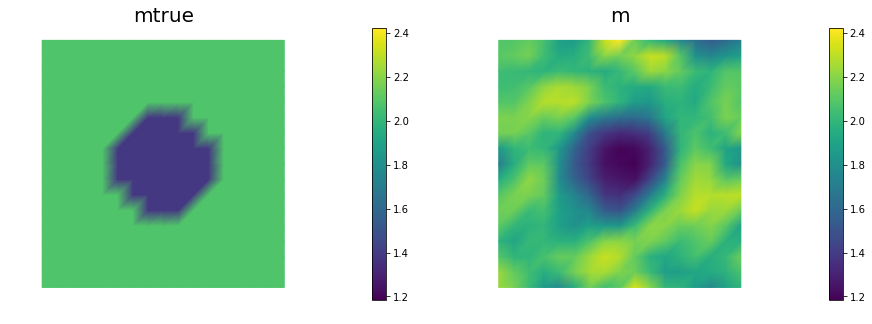


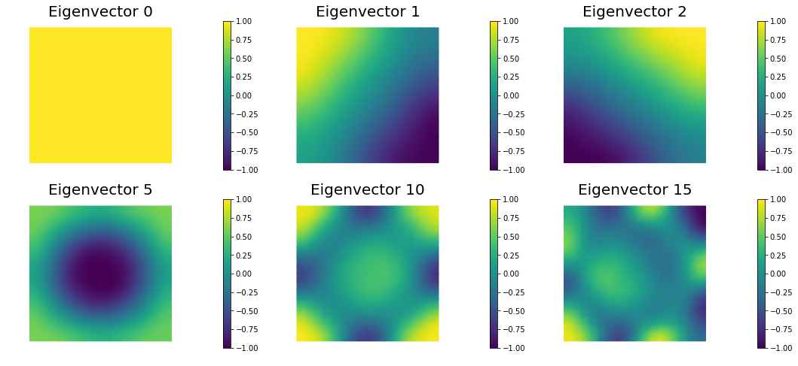


    Nit   CGit   cost          misfit        reg           sqrt(-G*D)    ||grad||       alpha  tolcg
     1     1     6.55848e-07   6.55848e-07   5.68862e-15   5.03043e-03   6.09740e-05    1.00   5.000e-01
     2     1     1.08723e-07   1.08723e-07   1.04943e-14   1.04930e-03   7.91395e-06    1.00   3.603e-01
     3     1     1.05332e-07   1.05332e-07   1.14304e-14   8.23607e-05   6.79620e-07    1.00   1.056e-01
     4    16     8.45882e-08   8.16759e-08   2.91227e-09   2.05009e-04   2.89425e-07    1.00   6.890e-02
     5     1     8.39902e-08   8.10779e-08   2.91226e-09   3.45821e-05   2.01908e-07    1.00   5.754e-02
     6    18     8.28507e-08   8.00869e-08   2.76380e-09   4.69028e-05   9.23200e-08    1.00   3.891e-02
     7    12     8.28296e-08   8.00394e-08   2.79017e-09   6.50020e-06   1.27988e-08    1.00   1.449e-02
     8    42     8.28247e-08   7.99460e-08   2.87868e-09   3.11439e-06   5.77801e-09    1.00   9.735e-03
    Newton's method converged in  8   iterations
    Total number of CG iterations:  92


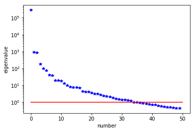


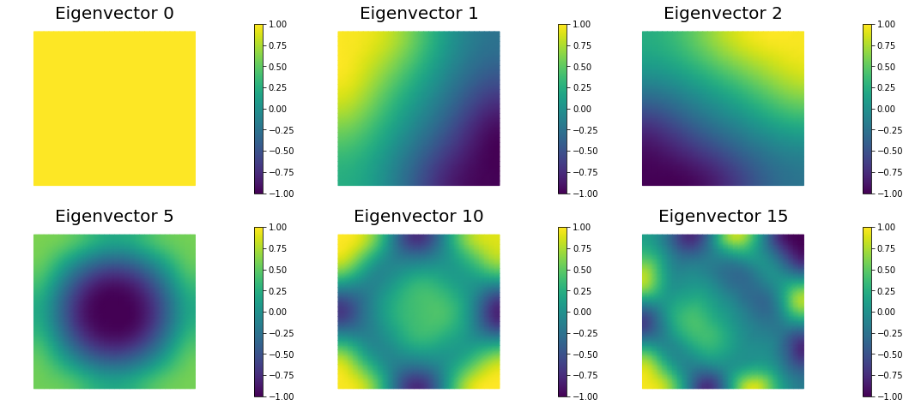


    Nit   CGit   cost          misfit        reg           sqrt(-G*D)    ||grad||       alpha  tolcg
     1     1     6.58142e-07   6.58142e-07   5.72949e-15   5.03518e-03   6.10279e-05    1.00   5.000e-01
     2     1     1.09119e-07   1.09119e-07   1.05678e-14   1.05113e-03   7.92104e-06    1.00   3.603e-01
     3     1     1.05703e-07   1.05703e-07   1.14966e-14   8.26634e-05   6.71773e-07    1.00   1.049e-01
     4    12     8.89432e-08   8.76464e-08   1.29679e-09   1.83051e-04   2.70869e-07    1.00   6.662e-02
     5     1     8.85420e-08   8.72452e-08   1.29680e-09   2.83252e-05   1.74444e-07    1.00   5.346e-02
     6    25     8.74799e-08   8.58267e-08   1.65324e-09   4.56526e-05   7.38359e-08    1.00   3.478e-02
     7     1     8.74777e-08   8.58245e-08   1.65324e-09   2.10127e-06   1.32274e-08    1.00   1.472e-02
     8    42     8.74720e-08   8.57698e-08   1.70212e-09   3.38632e-06   6.15204e-09    1.00   1.004e-02
    Newton's method converged in  8   iterations
    Total number of CG iterations:  84


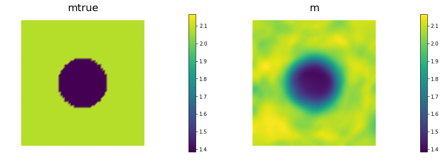


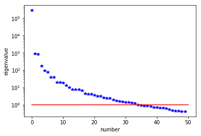


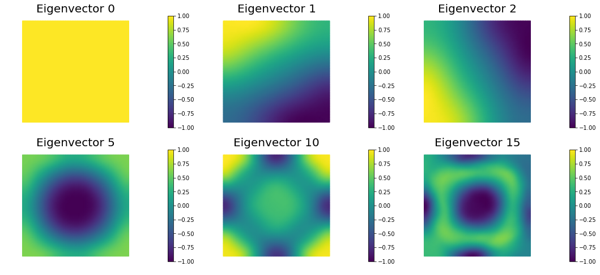


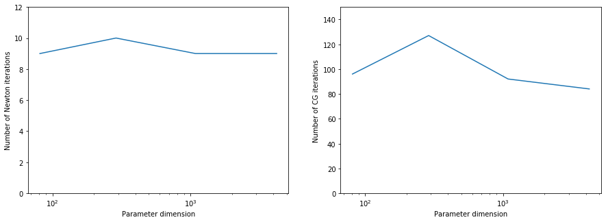


```python
## Question 2
n = 64
gammas = [1e-7, 1e-8, 1e-9, 1e-10]
misfits = []

for gamma in gammas:
    ndof, niter, ncgiter, noise_norm2, cost,misfit,reg = AddDiffInverseProblem(nx=n, ny=n, v=dl.Constant((30., 0.)), gamma = gamma)
    misfits.append(misfit)
    
plt.loglog(gammas, misfits, "-*b", label="Misfit")
plt.loglog([gammas[0],gammas[-1]], [.5*noise_norm2, .5*noise_norm2], "-r", label="Squared norm noise")
plt.title("Morozov discrepancy principle")
plt.xlabel("Regularization parameter")
plt.ylabel("Misfit cost")
plt.show()

print("Solve for gamma = ", 1e-9)
_ = AddDiffInverseProblem(nx=n, ny=n, v=dl.Constant((30., 0.)), gamma = 1e-9)
```

    Nit   CGit   cost          misfit        reg           sqrt(-G*D)    ||grad||       alpha  tolcg
     1     1     1.44588e-07   1.44586e-07   2.00173e-12   3.37098e-03   2.50569e-05    1.00   5.000e-01
     2     1     8.86418e-08   8.86394e-08   2.42031e-12   3.33919e-04   1.92835e-06    1.00   2.774e-01
     3     4     8.34694e-08   8.12340e-08   2.23540e-09   1.01648e-04   3.25286e-07    1.00   1.139e-01
     4     7     8.34411e-08   8.10895e-08   2.35165e-09   7.50678e-06   3.16071e-08    1.00   3.552e-02
     5     9     8.34411e-08   8.10835e-08   2.35763e-09   1.70916e-07   6.93261e-10    1.00   5.260e-03
    Newton's method converged in  5   iterations
    Total number of CG iterations:  22


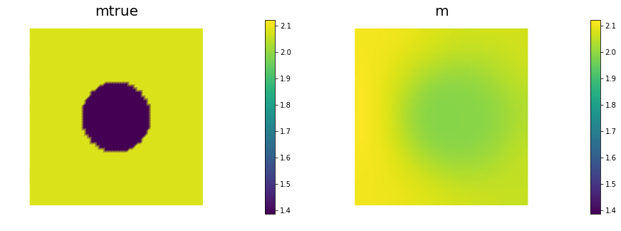


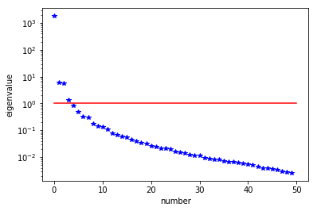


    Nit   CGit   cost          misfit        reg           sqrt(-G*D)    ||grad||       alpha  tolcg
     1     1     1.44939e-07   1.44939e-07   2.00232e-13   3.37795e-03   2.50983e-05    1.00   5.000e-01
     2     1     8.78893e-08   8.78890e-08   2.41984e-13   3.37130e-04   1.94176e-06    1.00   2.781e-01
     3     4     7.79193e-08   7.66288e-08   1.29044e-09   1.40354e-04   3.32301e-07    1.00   1.151e-01
     4     7     7.68263e-08   7.46023e-08   2.22399e-09   4.63259e-05   9.26959e-08    1.00   6.077e-02
     5    14     7.67618e-08   7.43152e-08   2.44655e-09   1.13002e-05   2.45569e-08    1.00   3.128e-02
     6    10     7.67617e-08   7.43074e-08   2.45429e-09   3.46780e-07   8.43866e-10    1.00   5.798e-03
    Newton's method converged in  6   iterations
    Total number of CG iterations:  37


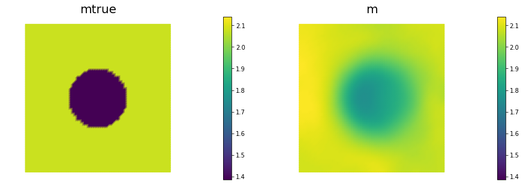


    Nit   CGit   cost          misfit        reg           sqrt(-G*D)    ||grad||       alpha  tolcg
     1     1     1.44981e-07   1.44981e-07   2.00324e-14   3.37487e-03   2.50691e-05    1.00   5.000e-01
     2     1     8.87973e-08   8.87973e-08   2.42711e-14   3.34674e-04   1.92672e-06    1.00   2.772e-01
     3     4     7.81429e-08   7.79532e-08   1.89704e-10   1.44841e-04   3.11119e-07    1.00   1.114e-01
     4    10     7.33249e-08   7.22366e-08   1.08832e-09   9.68686e-05   1.28882e-07    1.00   7.170e-02
     5     4     7.31164e-08   7.20600e-08   1.05634e-09   2.04324e-05   5.33343e-08    1.00   4.612e-02
     6    31     7.25776e-08   7.08738e-08   1.70377e-09   3.30728e-05   4.13228e-08    1.00   4.060e-02
     7    15     7.25756e-08   7.08991e-08   1.67650e-09   1.96776e-06   3.23088e-09    1.00   1.135e-02
    Newton's method converged in  7   iterations
    Total number of CG iterations:  66


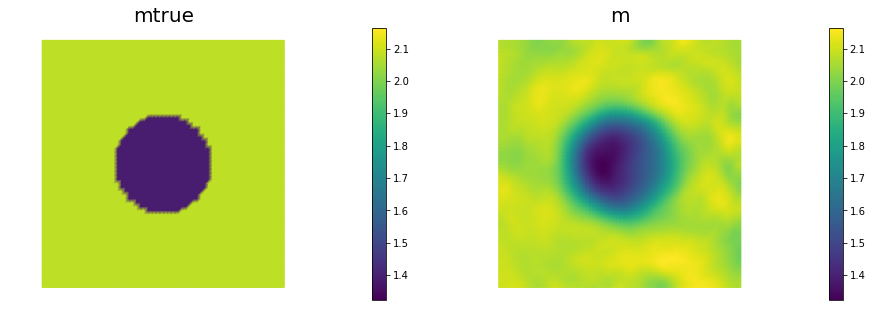


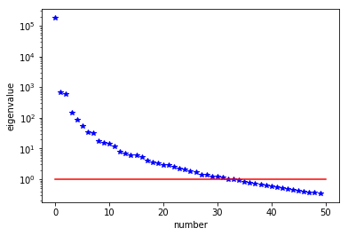


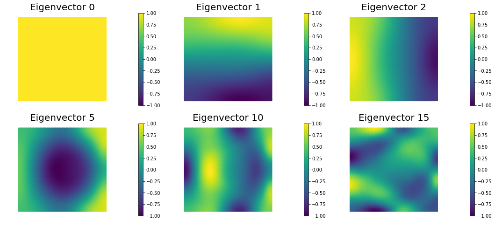


    Nit   CGit   cost          misfit        reg           sqrt(-G*D)    ||grad||       alpha  tolcg
     1     1     1.43579e-07   1.43579e-07   1.99758e-15   3.37306e-03   2.50540e-05    1.00   5.000e-01
     2     1     8.70986e-08   8.70986e-08   2.41358e-15   3.35492e-04   1.93089e-06    1.00   2.776e-01
     3     4     7.63948e-08   7.63771e-08   1.76503e-11   1.45565e-04   3.25078e-07    1.00   1.139e-01
     4    10     7.18017e-08   7.16849e-08   1.16809e-10   9.49715e-05   1.17995e-07    1.00   6.863e-02
     5     4     7.15428e-08   7.14293e-08   1.13449e-10   2.28159e-05   6.15462e-08    1.00   4.956e-02
     6    79     6.97122e-08   6.87528e-08   9.59426e-10   6.26379e-05   5.10730e-08    1.00   4.515e-02
     7     4     6.96823e-08   6.87259e-08   9.56407e-10   7.72313e-06   1.68136e-08    1.00   2.591e-02
     8    88     6.96420e-08   6.87288e-08   9.13283e-10   8.89695e-06   7.25118e-09    1.00   1.701e-02
    Newton's method converged in  8   iterations
    Total number of CG iterations:  191


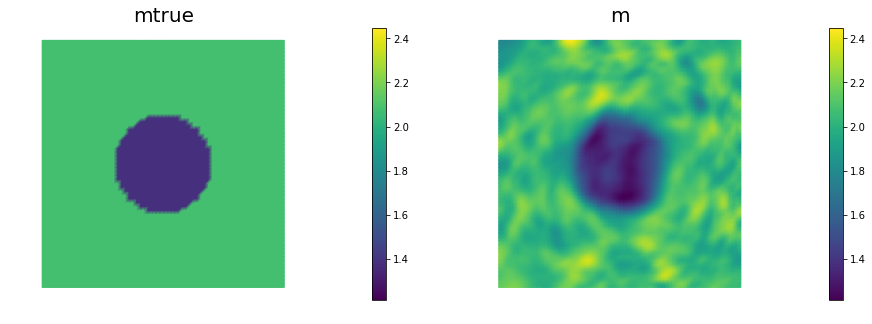


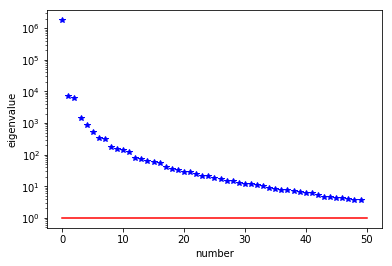


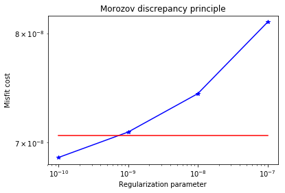


    Solve for gamma =  1e-09
    Nit   CGit   cost          misfit        reg           sqrt(-G*D)    ||grad||       alpha  tolcg
     1     1     1.43675e-07   1.43675e-07   2.00379e-14   3.37223e-03   2.50586e-05    1.00   5.000e-01
     2     1     8.80064e-08   8.80064e-08   2.42768e-14   3.33150e-04   1.92489e-06    1.00   2.772e-01
     3     4     7.63877e-08   7.61804e-08   2.07306e-10   1.51268e-04   3.19899e-07    1.00   1.130e-01
     4     8     7.22529e-08   7.13474e-08   9.05514e-10   9.00258e-05   1.24214e-07    1.00   7.041e-02
     5    10     7.14981e-08   7.03149e-08   1.18324e-09   3.88606e-05   6.64498e-08    1.00   5.150e-02
     6    35     7.12458e-08   6.96656e-08   1.58016e-09   2.24734e-05   3.18522e-08    1.00   3.565e-02
     7    18     7.12455e-08   6.96649e-08   1.58064e-09   7.64028e-07   1.47711e-09    1.00   7.678e-03
    Newton's method converged in  7   iterations
    Total number of CG iterations:  77


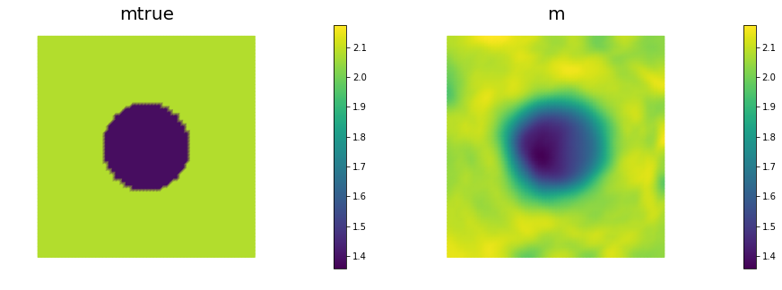


> Copyright &copy; 2016-2018, The University of Texas at Austin & University of California, Merced.
All Rights reserved.
See file COPYRIGHT for details.

> This file is part of the hIPPYlib library. For more information and source code
availability see https://hippylib.github.io.

> hIPPYlib is free software; you can redistribute it and/or modify it under the terms of the GNU General Public License (as published by the Free Software Foundation) version 2.0 dated June 1991.
